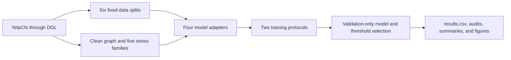

# Robustness of Graph-Based Fraud Detection on YelpChi

A controlled benchmark of heterophily, camouflage, and noisy neighborhoods

Final project report, 13 July 2026

The values in this report come from the executed notebook [KAGGLE_DUAL_T4_RESEARCH_RUN_with_outputs_latest_v4_r1_multi_seeds.ipynb](KAGGLE_DUAL_T4_RESEARCH_RUN_with_outputs_latest_v4_r1_multi_seeds.ipynb) and the evidence package [gfd-robustness-v4-factorial-report-r1](gfd-robustness-v4-factorial-report-r1/). I round values in the text and tables for readability. The CSV files in the evidence package keep the full precision.

## Abstract

Graph-based fraud detection can use relationships that are missing from ordinary tabular data, but this also creates a weakness. A graph model can fail when fraud nodes look more normal, connect to benign nodes, or receive many irrelevant neighbors. My goal in this project was to measure that weakness in a controlled and reproducible way instead of reporting performance on only one clean graph.

I built a robustness benchmark on YelpChi and compared four models: a feature-only MLP, GraphSAGE, a PMP adapter, and a SEC-GFD adapter. I tested five stress scenarios covering oracle and non-oracle rewiring, feature camouflage, relation camouflage, and random edge noise. I also used two evaluation protocols. In `train_on_variant`, a model was trained and tested on the same graph variant. In `train_clean_eval_all`, a model was trained only on the clean graph and then evaluated under graph or feature shift. The experiment used two train/validation/test allocations, three split seeds per allocation, two graph seeds, and five training seeds. It produced 5,040 complete and successful result rows.

PMP had the best clean Average Precision, ROC-AUC, and macro-F1 in both allocation regimes. It also had the highest absolute score in every non-oracle maximum-stress comparison for all three metrics. At the same time, it lost more AP under unexpected graph shift than the MLP and SEC-GFD, which started from lower clean scores. This showed that high stressed performance and a small drop are different meanings of robustness. The MLP was exactly unchanged by graph-only stress, but it did not reach PMP's absolute performance.

Feature camouflage was the most consistent weakness because it reduced the performance of every model. Oracle rewiring produced the largest protocol reversal: SEC-GFD reached almost perfect results when it was trained on label-constructed topology, but it fell to near-random ranking when a clean-trained model met the same topology. I treat this as a privileged diagnostic, not a deployment result. The overall conclusion is that PMP was the strongest integrated detector in this benchmark, while careful protocol labels, realized-change audits, and repeated seeds were necessary to understand what the scores actually meant.

## 1. Introduction

### 1.1 Problem and motivation

Fraud detection is often treated as a classification problem where each account, review, or transaction is judged from its own attributes. This misses an important part of the problem. Suspicious entities can share users, products, devices, payment methods, or other connections. A graph represents these relationships directly, so a graph neural network can use information from nearby nodes when it makes a prediction.

That extra information is useful only when the neighborhood can be trusted. Fraud graphs are strongly imbalanced because most nodes are normal. A fraud node can therefore have many normal neighbors even without an attack. Fraudsters can also make their attributes look normal, or create links to benign entities so that their local structure looks less suspicious. Random and outdated links can add more noise. In these cases, ordinary message passing may mix useful and misleading information.

This creates a practical question that clean test performance cannot answer: what happens after the node features or graph neighborhood become less reliable? A model can have a high clean score and still be sensitive to shift. Another model can have a small drop only because it uses little graph information in the first place. I wanted the benchmark to show both sides.

The task is node-level binary classification on YelpChi. The positive class is made from Yelp-filtered reviews and the negative class from Yelp-recommended reviews. I follow the graph fraud detection literature and call the positive class fraud or spam, but these labels should not be read as independently verified criminal behavior. YelpChi is also imbalanced: only 6,677 of 45,954 nodes are positive, or about 14.53%. Because of this, I use Average Precision as the main metric instead of relying only on accuracy or ROC-AUC.

### 1.2 Objective and research questions

My main question was: when node features or graph neighborhoods become less reliable, which fraud detectors lose performance, under which controlled stress, and do the main conclusions survive different splits, graph realizations, training seeds, and label allocations?

I broke this into five parts. First, I compared clean performance. Second, I measured absolute performance under stress and the drop from the clean score. Third, I compared retraining on the changed graph with a sudden clean-to-stress shift. Fourth, I checked whether the model ranking remained stable across several sources of randomness. Finally, I audited the variants themselves so that a configured severity was not accepted without checking what it actually changed.

My project is a benchmark, not a new fraud-detection architecture. Its contribution is the shared evaluation setup: the same data, graph variants, masks, metrics, protocols, result schema, and audit rules are used for all four models. This makes the comparison more controlled than copying numbers from separate papers.

### 1.3 Positioning of the project

The project sits between work on camouflage-resistant fraud detection, work on heterophily-aware graph models, and work on reliable GNN evaluation. CARE-GNN motivated the two camouflage types. PMP, SEC-GFD, and GAGA motivated different ways of handling mixed or low-homophily neighborhoods. The evaluation design was influenced by the warning from Pitfalls of Graph Neural Network Evaluation that rankings can change with splits, initializations, and training choices.

I do not compare my numbers directly with paper tables. The papers use different graph views, splits, label rates, metrics, and training recipes. My PMP and SEC-GFD integrations also use a shared homogeneous graph and reduced feasibility settings. The correct comparison is therefore about ideas and observed behavior, not a claim that I reproduced or beat the published systems.

## 2. Related research

### 2.1 YelpChi and the baseline model

The review data behind YelpChi is connected to the opinion-spam work of Rayana and Akoglu [1]. In the DGL dataset used here [8], reviews are graph nodes with 32 handcrafted attributes. Three relation types connect reviews written by the same user, reviews of the same product with the same rating, and reviews of the same product in the same month. This makes YelpChi a useful test case because it contains node attributes, dense relationship information, class imbalance, and several relation meanings.

GraphSAGE was my standard GNN baseline [2]. Its main idea is to create a node representation by aggregating features from a local neighborhood. The original method was designed as an inductive framework that can generate representations for unseen nodes. In my benchmark I use a simpler two-layer mean-aggregation version on the full homogeneous YelpChi graph. It gives me a familiar message-passing baseline between the graph-blind MLP and the two specialized fraud models.

### 2.2 Camouflage and low-homophily methods

CARE-GNN is the paper that most directly motivated my camouflage scenarios [3]. It describes feature camouflage, where fraud attributes look more like normal attributes, and relation camouflage, where fraud nodes create benign-looking connections. CARE-GNN learns a label-aware similarity score, selects useful neighbors, and combines relation-specific information. I used its two camouflage ideas to define controlled feature and relation transformations, but CARE-GNN itself was not part of the executed model set.

GAGA focuses on low homophily [4]. It groups neighborhood information using labels, hops, and relation context, then applies a Transformer instead of immediately averaging all neighbor messages. This is another possible answer to harmful neighbor mixing. I kept GAGA as related work because its preprocessing and native relation-aware pipeline were outside the final run. It remains a relevant future comparator.

### 2.3 PMP and SEC-GFD

PMP, or Partitioning Message Passing, handles the mixture of fraud, normal, and unlabeled neighbors by processing their messages differently [5]. The purpose is to stop the majority class from dominating a shared aggregation rule and to let the center node adjust how it uses mixed neighborhoods. This is closely related to my heterophily and noisy-neighborhood tests. The integrated PMP/LA-SAGE-S adapter was one of the two specialized methods I actually evaluated.

SEC-GFD approaches heterophily from a spectral direction [6]. It combines a hybrid-pass graph filter with a local environmental constraint, so it tries to keep useful low- and high-frequency information and use labels more effectively. This gave me a useful contrast with PMP's partitioned message passing. I integrated a reduced-cost SEC-GFD adapter into the same runner.

### 2.4 Evaluation reliability

Pitfalls of Graph Neural Network Evaluation is not a fraud paper, but it affected the design of this project [7]. It shows that model rankings can change when data splits, initializations, early stopping, or tuning choices change. This is why I did not trust a single successful run. I used three split seeds, five training seeds, two independent graph seeds, two allocation regimes, and a feature-only MLP control.

The relationship between the papers and this project is summarized below.

| Work | Main idea | Role in my project |
|---|---|---|
| GraphSAGE | Aggregate local neighbor features to build node representations | Standard message-passing baseline |
| CARE-GNN | Select and aggregate useful neighbors to resist feature and relation camouflage | Motivation for the two camouflage scenarios; not executed |
| GAGA | Group low-homophily neighborhoods and process them with label, hop, relation, and Transformer components | Related heterophily method and future comparator; not executed |
| PMP | Partition messages from fraud, normal, and unlabeled neighbors | Specialized model integrated through a feasibility adapter |
| SEC-GFD | Combine hybrid spectral filtering with a local environmental constraint | Specialized model integrated through a reduced-cost adapter |
| Pitfalls of GNN Evaluation | Show that splits and training choices can change model rankings | Motivation for repeated splits, seeds, and the MLP control |

## 3. Description of the system, methods, and experiment

### 3.1 System overview

The notebook is a self-contained research pipeline. It writes the benchmark modules into an isolated Kaggle workspace, installs pinned dependencies, downloads YelpChi and the pinned PMP and SEC-GFD repositories, applies small compatibility patches, runs tests, generates graph variants, launches the two-GPU training lanes, and produces one unified result table with audit and plotting files.

The graph cache was too large to keep all six split copies at once. The notebook therefore processed one split at a time. It completed both protocols for that split, archived the graph ledger, audit, results, active config, and hash receipt, then removed only the graph binaries before moving to the next split. This kept the experiment within Kaggle's disk limit while preserving a traceable evidence chain.

### 3.2 Dataset and graph representation

I loaded YelpChi with `dgl.data.FraudDataset('yelp')` [8]. The source is a three-relation heterograph, but I converted it to one homogeneous graph with `dgl.to_homogeneous`. Every model therefore saw the same 8,051,348 directed relation-edge entries. This made the model comparison consistent, although it removed relation identities that the full PMP, SEC-GFD, CARE-GNN, or GAGA pipelines could use.

| Dataset property | Executed value |
|---|---:|
| Nodes | 45,954 |
| Directed edges | 8,051,348 |
| Features per node | 32 |
| Positive nodes | 6,677 |
| Negative nodes | 39,277 |
| Positive-class prevalence | 14.5297% |
| Mean in/out degree | 175.2045 |
| Median degree | 175 |
| Clean true-label heterophily | 0.226880 |
| Source relation types | R-S-R, R-T-R, R-U-R |

The positive and negative classes were split separately before masks were formed, so all partitions kept nearly the same class ratio. A fixed mask was reused for every graph variant within a split.

### 3.3 Factorial split and seed design

I used two train/validation/test allocations. Each allocation used the same three split seeds: 717, 1729, and 3253.

| Allocation | Split IDs | Train nodes | Validation nodes | Test nodes |
|---|---|---:|---:|---:|
| 40/20/40 | r40_s0, r40_s1, r40_s2 | 18,380 | 9,190 | 18,384 |
| 60/20/20 | r60_s0, r60_s1, r60_s2 | 27,572 | 9,190 | 9,192 |

The paired seeds make the allocation comparison more controlled, but it is not a pure learning curve. Moving from 40% to 60% training changes the validation and test membership as well as the test size. I therefore keep the two regimes separate and describe their difference as allocation sensitivity, not the causal gain from 20% more labels.

For every positive-severity stress, I crossed graph seeds 0 and 1 with training seeds 0, 1, 2, 3, and 4. One allocation-level model/protocol/severity mean is therefore based on three splits, two graph realizations per split, and five optimization seeds per realization. The clean graph has five real optimization runs per split; repeated clean references in derived stress tables are not extra fits.

The graph ledger contains 186 rows, including clean aliases that are kept for audit traceability. The evaluated matrix contains 126 distinct clean or stressed graph states. Its size is:

`6 splits × 21 evaluated graph states × 5 training seeds × 4 models × 2 protocols = 5,040 evaluations`.

### 3.4 Evaluated models

All four models used Adam optimization, validation ROC-AUC for early stopping, and a validation-selected macro-F1 threshold. Class weighting was based only on the training labels where it was enabled.

| Model | Executed configuration | Purpose in the benchmark |
|---|---|---|
| MLP | 32-128-128-2; ReLU; dropout 0.5; learning rate 0.001; weight decay 0.0005; weighted cross-entropy; maximum 100 epochs; patience 10 | Feature-only control that cannot react to graph-only changes |
| GraphSAGE | Two mean `SAGEConv` layers; hidden size 64; dropout 0.5; learning rate 0.01; weight decay 0.0005; weighted cross-entropy; maximum 100 epochs; patience 10 | Conventional message-passing baseline |
| PMP / LA-SAGE-S adapter | One layer; hidden size 48; incoming fanout 10; batch size 512; row-normalized features; dropout 0; learning rate 0.01; no weight decay; unweighted cross-entropy; maximum 100 epochs; patience 10 | Feasibility integration of partitioned message passing |
| SEC-GFD adapter | Hidden size 32; polynomial order 2; one high-order term; constraint coefficient 0.2; learning rate 0.01; no weight decay; weighted cross-entropy plus the fixed environment/NCE term; maximum 50 epochs; patience 10 | Reduced-cost spectral and environmental-constraint integration |

These settings are the ones that actually ran. They are not all the same as the early planning guide or the original paper settings. The PMP config in the benchmark overrides the upstream Yelp config to use one sampled layer, fanout 10, 100 epochs, patience 10, batch size 512, and zero data-loader workers. Missing optional PyTorch Geometric normalization classes were replaced by identity modules. For SEC-GFD, zero-in-degree graph convolution was enabled, and the benchmark corrected the training-node indexing and numerical range in its environment loss. These changes made the adapters usable in the shared pipeline, but they also limit paper-level fidelity.

### 3.5 Stress scenarios

The benchmark contains five scenario families. A zero-severity graph is the clean reference, followed by two positive severity levels.

| Scenario | Positive severities | Transformation | Claim scope |
|---|---:|---|---|
| Oracle heterophily rewiring | 0.15, 0.30 | Rewire selected edge destinations to nodes with the opposite true label | Privileged diagnostic |
| Non-oracle rewiring | 0.15, 0.30 | Rewire toward the opposite side of a feature-derived two-means partition fixed for a graph seed | Operational controlled stress |
| Feature camouflage | 0.15, 0.30 | Select positive nodes and fully replace their 32 features with sampled negative-node features | Oracle-assisted mechanism diagnostic |
| Relation camouflage | 0.15, 0.30 | Select positive nodes, add negative neighbors, and remove part of their positive-neighbor links | Oracle-assisted mechanism diagnostic |
| Uniform edge noise | 0.10, 0.20 | Add random directed edges, allocated proportionally over the three source relations | Operational controlled stress |

Rewiring rejected self-loops, duplicate edges, and already existing edges. Relation camouflage used an addition budget equal to 25% of a selected node's out-degree, limited to 4 to 64 edges, and removed half as many suspicious positive-to-positive links as the number of realized additions. Feature camouflage used complete replacement, or `gamma = 1.0`.

The word oracle is important. Oracle transformations use true labels from all nodes, including test nodes, to construct the graph or select targets. Model fitting, early stopping, threshold selection, and metric calculation do not read test outcomes, but the oracle constructor does use test labels. I use these rows only to study mechanisms. The strictly operational ranking includes only non-oracle rewiring and uniform edge noise.

### 3.6 Training protocols

The two protocols answer different questions.

| Protocol | Training setup | Evaluation setup | Meaning |
|---|---|---|---|
| `train_on_variant` | Fit a new model on each clean or stressed graph | Test on the matching graph; choose threshold on that graph's validation mask | The changed environment is known and retraining is possible |
| `train_clean_eval_all` | Fit once on the clean graph for each split, model, and training seed | Reuse the clean model and clean validation threshold on every variant | The model meets an unexpected shift without retraining |

`train_on_variant` required 2,520 fits. The clean-shift protocol required only 120 fitted artifacts and reused them for 2,520 evaluations. In total, the run made 2,640 model fits. The shift protocol is more similar to sudden deployment change, while variant training measures adaptation after the new graph is available.

### 3.7 Metrics and statistical summaries

Average Precision is my primary metric. It summarizes the precision-recall ranking of the positive class and is useful for this imbalanced dataset. A random ranking has expected AP near the positive prevalence, about 0.145. ROC-AUC is also reported as a threshold-free ranking metric. Macro-F1 gives equal weight to the class-wise F1 scores, but it depends on a classification threshold.

The threshold was selected by maximizing macro-F1 on validation predictions and then frozen for the test set. Early stopping monitored validation ROC-AUC. This avoids choosing a threshold or epoch from test performance.

Within a split, the reporting code resampled the crossed graph and training seeds. Clean-to-stress drops and protocol contrasts used paired resampling. Allocation-level summaries then resampled the three split-level means with 1,000 bootstrap samples. The resulting intervals are useful as descriptive split-sensitivity bands, but three split means are not enough for strong population claims or formal significance testing.

For a performance drop, I use `clean metric - stressed metric`. A positive value is a loss. For a protocol contrast, I use `variant-trained metric - clean-trained-shift metric`. A positive value means retraining on the variant performed better.

### 3.8 Tools, hardware, and reproducibility

The run used a Kaggle Linux session with two independent NVIDIA Tesla T4 GPUs, each with 15,360 MiB of memory, and about 31.35 GiB of system RAM. The notebook created an isolated Python 3.11.15 runtime with PyTorch 2.1.0+cu118, DGL 1.1.3+cu118, NumPy 1.26.4, SciPy 1.11.4, pandas 2.2.3, and Matplotlib 3.9.2. The two GPUs ran separate work lanes rather than one data-parallel model.

The end-to-end notebook time was about 8 hours 52 minutes. Summed lane time was about 10.03 hours because some tasks overlapped. PMP accounted for about 81% of lane compute. These timings help explain the experiment cost, but they are not a fair speed benchmark because the models use different batch styles, epoch limits, and shared lanes.

The notebook pinned PMP commit `3f7629f6c180891a0bc1bba3c66d94d288a1ddae` and SEC-GFD commit `97faa51145ed1fbcbdc67cc5d399490da9a9797a`. The executed config SHA-256 is `77d2215791b18233b2ba3b079431ac09941e0e7528c934649e9793b64245b909`, and the run fingerprint is `e419afb9dcdffa3c922c355b3964e9d06e54164b7bcef01646262a7c2814dd41`. The notebook also stored source-module hashes, patch hashes, result hashes, and split receipts. Sixteen setup tests passed, all 36 GPU lane tasks succeeded on their first attempt, and the final manifest status is complete.

## 4. Results

### 4.1 Completeness and evidence checks

Before interpreting model scores, I checked whether the result matrix was complete. The unified [results.csv](gfd-robustness-v4-factorial-report-r1/results.csv) contains exactly 5,040 rows and 32 columns. Every expected run key is present and unique. All rows have `status=ok`, all error fields are empty, and there are no missing, infinite, or out-of-range metrics. The generated [missing_or_error_runs.csv](gfd-robustness-v4-factorial-report-r1/plots/missing_or_error_runs.csv) contains only its header.

The six split-local result archives reproduce the unified table. The stage summaries, cross-split curves, clean-to-stress drops, protocol contrasts, and robustness scores also reproduce from the lower-level evidence. All 49 manifest and split-receipt checksum comparisons passed. This does not prove that every scientific choice was ideal, but it does show that the reported numbers come from a complete and traceable run.

### 4.2 What the stress tests actually changed

Configured severity is not enough by itself, so I used [variant_audit.csv](gfd-robustness-v4-factorial-report-r1/variant_audit.csv) to inspect the realized treatments. Every requested count was achieved exactly.

| Scenario | Severity | Realized intervention | Main realized change |
|---|---:|---|---|
| Feature camouflage | 0.15 | 1,001 positive nodes replaced | Mean cosine to sampled negative donor: 0.84049 to 1.00000 |
| Feature camouflage | 0.30 | 2,003 positive nodes replaced | Mean cosine: 0.83979 to 1.00000 |
| Relation camouflage | 0.15 | 1,001 nodes; 38,443-39,764 edges added and half as many removed | Selected positive-to-negative neighbor ratio about 0.8104 to 0.9342 |
| Relation camouflage | 0.30 | 2,003 nodes; 77,163-77,540 added and 38,581-38,770 removed | Selected ratio about 0.8174 to 0.9410 |
| Non-oracle rewiring | 0.15 | 1,207,702 edges rewired | True-label heterophily increased by 0.00257 |
| Non-oracle rewiring | 0.30 | 2,415,404 edges rewired | True-label heterophily increased by 0.00522 |
| Oracle rewiring | 0.15 | 1,207,702 edges rewired | True-label heterophily increased by 0.11604 |
| Oracle rewiring | 0.30 | 2,415,404 edges rewired | True-label heterophily increased by 0.23186, to about 0.45875 |
| Uniform edge noise | 0.10 | 805,134 directed edges added | Total edges increased to about 8.856 million |
| Uniform edge noise | 0.20 | 1,610,269 directed edges added | Total edges increased to 9,661,617 |

The most important audit result is the difference between the two rewiring methods. At severity 0.30, both methods rewired exactly 2,415,404 edges. The oracle method changed true-label heterophily by about 0.232, while the non-oracle method changed it by only about 0.005. The oracle shift was around 44 times larger. The feature partition's positive rate was about 37.10%, far from the true 14.53% positive rate.

This means the non-oracle scenario is a strong neighborhood-churn test but only a weak achieved heterophily test. Calling it simply “30% heterophily” would be misleading. The audit also showed that oracle rewiring changed destination in-degree patterns, relation camouflage changed both neighborhood composition and density, and uniform noise mostly changed density rather than label mixing. These are controlled stress tests, not perfectly isolated causal treatments.

Figure 1. Realized perturbations across the two allocation regimes. The allocation lines overlap because the same graph plan was intentionally reused across masks. Each panel uses a different audit unit, so the slopes should not be compared as if they were on one common scale. In the two camouflage panels, the plotted value is the effect on selected nodes; the number of selected nodes doubles from severity 0.15 to 0.30.

### 4.3 Clean performance

The next table uses the clean row from the standard `train_on_variant` execution. AP includes the descriptive 95% split-bootstrap interval; ROC-AUC and macro-F1 are cross-split means. The complete interval table is in [summary_curves_cross_split.csv](gfd-robustness-v4-factorial-report-r1/plots/summary_curves_cross_split.csv).

| Allocation | Model | AP and split band | ROC-AUC | Macro-F1 |
|---|---|---:|---:|---:|
| 40/20/40 | MLP | 0.4060 [0.3999, 0.4112] | 0.7824 | 0.6538 |
| 40/20/40 | GraphSAGE | 0.3992 [0.3834, 0.4306] | 0.7651 | 0.6497 |
| 40/20/40 | PMP | 0.5553 [0.5522, 0.5573] | 0.8456 | 0.7175 |
| 40/20/40 | SEC-GFD | 0.4498 [0.4456, 0.4547] | 0.7999 | 0.6746 |
| 60/20/20 | MLP | 0.4240 [0.4016, 0.4495] | 0.7905 | 0.6566 |
| 60/20/20 | GraphSAGE | 0.3901 [0.3736, 0.4052] | 0.7560 | 0.6396 |
| 60/20/20 | PMP | 0.5825 [0.5567, 0.6044] | 0.8536 | 0.7267 |
| 60/20/20 | SEC-GFD | 0.4580 [0.4464, 0.4735] | 0.8037 | 0.6746 |

PMP was first and SEC-GFD was second for all three clean metrics in both allocations. This ordering also held at every individual split and in both protocol executions. PMP's clean AP lead over SEC-GFD was roughly 0.10 in the 40/20/40 regime and 0.12 in the 60/20/20 regime.

The MLP was competitive with, and in the five-seed mean slightly better than, GraphSAGE. This is an important baseline result. On this homogeneous graph, ordinary mean aggregation did not automatically add useful information. Later seed analysis shows that the exact order of these two baselines depends on a GraphSAGE failure seed, so I do not treat it as a universal model comparison.

### 4.4 Operational non-oracle stress

The main deployment-style comparison uses only non-oracle rewiring and uniform edge noise. The values come from [performance_drop_max_stress_cross_split.csv](gfd-robustness-v4-factorial-report-r1/plots/performance_drop_max_stress_cross_split.csv). Each cell below is `stressed AP (clean AP - stressed AP)`. A positive value in parentheses is a loss; a negative value means the stressed score was higher. “Shift” means train clean and evaluate the changed graph. “Variant” means train and evaluate on the changed graph.

| Allocation and protocol | Scenario at maximum severity | MLP | GraphSAGE | PMP | SEC-GFD |
|---|---|---:|---:|---:|---:|
| 40, shift | Non-oracle rewiring 0.30 | 0.4060 (+0.0000) | 0.3881 (+0.0101) | 0.4849 (+0.0704) | 0.4429 (+0.0092) |
| 40, shift | Uniform edge noise 0.20 | 0.4060 (+0.0000) | 0.3922 (+0.0061) | 0.5062 (+0.0491) | 0.4466 (+0.0056) |
| 40, variant | Non-oracle rewiring 0.30 | 0.4060 (+0.0000) | 0.3740 (+0.0252) | 0.5127 (+0.0426) | 0.4594 (-0.0096) |
| 40, variant | Uniform edge noise 0.20 | 0.4060 (+0.0000) | 0.3640 (+0.0352) | 0.5175 (+0.0378) | 0.4562 (-0.0065) |
| 60, shift | Non-oracle rewiring 0.30 | 0.4240 (+0.0000) | 0.3804 (+0.0100) | 0.5022 (+0.0803) | 0.4467 (+0.0073) |
| 60, shift | Uniform edge noise 0.20 | 0.4240 (+0.0000) | 0.3849 (+0.0054) | 0.5287 (+0.0538) | 0.4500 (+0.0040) |
| 60, variant | Non-oracle rewiring 0.30 | 0.4240 (+0.0000) | 0.3782 (+0.0120) | 0.5321 (+0.0504) | 0.4655 (-0.0075) |
| 60, variant | Uniform edge noise 0.20 | 0.4240 (+0.0000) | 0.3778 (+0.0124) | 0.5355 (+0.0470) | 0.4675 (-0.0095) |

PMP had the highest stressed AP in all eight rows. The same winner pattern held for ROC-AUC and macro-F1. Across both positive severities, it also won every aggregate operational AP comparison. At maximum stress, its AP lead over the best non-PMP model was between 0.0420 and 0.0787, and the lead was positive in all three split replicates for every row.

PMP did not have the smallest drop. Under unexpected non-oracle rewiring it lost 0.0704 AP in the 40% regime and 0.0803 in the 60% regime. Under edge noise it lost 0.0491 and 0.0538. SEC-GFD and GraphSAGE had smaller shift losses, while the MLP had exactly zero graph-only loss because it never reads the graph.

This is the main lesson of the benchmark. A small drop and a high stressed score are not the same result. The MLP kept 100% of its lower clean AP. PMP kept less, around 88% to 93% when the two maximum operational stresses are averaged, but still gave the strongest absolute predictions. If I ranked only by retention, the graph-blind control would look best. If I ranked only by stressed AP, I would hide PMP's greater sensitivity to sudden graph change. Both values are needed.

Retraining was also model-dependent. The direct values are in [protocol_contrasts_cross_split.csv](gfd-robustness-v4-factorial-report-r1/plots/protocol_contrasts_cross_split.csv). At maximum non-oracle rewiring, variant training improved PMP over clean-trained shift by 0.0278 AP in the 40% regime and 0.0298 in the 60% regime. The gains under noise were 0.0113 and 0.0068. SEC-GFD usually gained about 0.01 to 0.02. GraphSAGE became worse under most matched-retraining comparisons, especially in the 40% regime. Exposure to a changed graph was therefore helpful for PMP and SEC-GFD, not a general solution for every model.

The normalized area under each severity curve in [robustness_scores_cross_split.csv](gfd-robustness-v4-factorial-report-r1/plots/robustness_scores_cross_split.csv) tells the same story. After dividing by each scenario's severity span and averaging the two operational scenarios, PMP had the best AP in all four allocation/protocol contexts, ranging from 0.5204 to 0.5523. This shows that its lead was not limited to the endpoint.

### 4.5 Feature and relation camouflage

Feature camouflage was the only stress that changed the MLP, and it hurt all four models in every allocation and protocol. At severity 0.30, AP losses ranged from about 0.078 to 0.134. The curves were monotone: more selected positive nodes with fully replaced features meant lower performance. For example, clean-trained PMP in the 40/20/40 regime moved from 0.5553 to 0.4968 and then 0.4387. In the 60/20/20 regime it moved from 0.5825 to 0.5236 and then 0.4629.

PMP often had the largest absolute feature-camouflage drop, but it still had the best stressed AP, around 0.427 to 0.463 depending on protocol and allocation. This is another example where a larger loss does not mean a worse final detector. More importantly, feature camouflage exposed a shared dependency: graph context did not fully replace the information lost when positive-node attributes were copied from negative donors.

Relation camouflage had a smaller metric effect at the tested budget. At maximum severity it materially changed selected neighborhoods, adding around 77,000 edges and removing around 38,700, but MLP stayed unchanged, GraphSAGE changed only slightly, and PMP lost about 0.002 to 0.019 AP. SEC-GFD often improved, especially with variant training. I do not call this proof of camouflage resistance. The treatment used labels to choose positive nodes, changed degree and heterophily together, and was not adapted to attack each model. The supported conclusion is simply that this specific bounded relation treatment had a modest effect.

### 4.6 All-scenario AP drops

The heatmap below gives a compact view of maximum-stress AP drops over all five scenarios. Positive numbers mean a loss; negative numbers mean the stressed score was higher than clean.

Figure 2. Maximum-stress AP drop by allocation, protocol, scenario, and model. The extreme SEC-GFD values under oracle rewiring set most of the color range, so the smaller operational differences look visually pale. For this reason I use the numeric non-oracle table above as the main operational result.

Across all five maximum-severity scenarios, PMP won 16 of the 20 allocation-by-protocol rows. The exceptions were all oracle rewiring: MLP won the two clean-trained shift rows because it ignored the graph, and SEC-GFD won the two variant-trained rows by learning the label-constructed topology. The AP, ROC-AUC, and macro-F1 winner patterns were identical.

### 4.7 Oracle rewiring and the protocol reversal

Oracle rewiring produced the most dramatic result in the project. It intentionally connected selected sources toward true opposite-label destinations. At severity 0.30, true-label heterophily rose from 0.2269 to about 0.4587.

| Model | 40% clean-trained shift AP | 40% variant-trained AP | 60% clean-trained shift AP | 60% variant-trained AP |
|---|---:|---:|---:|---:|
| MLP | 0.4060 | 0.4060 | 0.4240 | 0.4240 |
| GraphSAGE | 0.3639 | 0.6207 | 0.3625 | 0.6234 |
| PMP | 0.3823 | 0.6124 | 0.3792 | 0.6550 |
| SEC-GFD | 0.1365 | 1.0000 | 0.1415 | 1.0000 |

When clean-trained graph models met this new structure, their performance fell. SEC-GFD reached ROC-AUC 0.4736 and AP 0.1365 in the 40% regime, then ROC-AUC 0.4917 and AP 0.1415 in the 60% regime. These AP values are around or below the positive prevalence reference.

When the same models were trained on the oracle-rewired graph, the result reversed. GraphSAGE and PMP improved strongly, and SEC-GFD became almost perfect. The raw table contains 56 rows with exactly perfect ROC-AUC and AP, all from SEC-GFD trained on severity-0.30 oracle graphs.

This is not evidence that SEC-GFD is perfectly robust. The topology was constructed with labels from all nodes, including test nodes, and the model was then trained on that topology. It created a privileged structural signal. The result is still useful because it shows how strongly a graph model can depend on whether a structural regime is present during training, but it cannot be included in an operational leaderboard.

Figure 3. Selected Average Precision curves. The feature-camouflage panels show steady degradation. The oracle-rewiring panels show the opposite outcomes of matched variant training and unexpected clean-to-stress shift. These are oracle-assisted diagnostics, so this figure supports mechanism discussion rather than the operational ranking.

### 4.8 Training-seed, graph-seed, and split stability

Repeated seeds changed the interpretation of the baseline models. The median standard deviation of stressed AP over the five training seeds was much larger for GraphSAGE than for PMP.

| Protocol | MLP | GraphSAGE | PMP | SEC-GFD |
|---|---:|---:|---:|---:|
| Clean-trained shift | 0.0423 | 0.0926 | 0.0131 | 0.0242 |
| Variant-trained | 0.0423 | 0.0957 | 0.0118 | 0.0233 |

GraphSAGE training seed 1 was the clearest failure. Its mean clean AP across splits and protocols was about 0.230, compared with about 0.433 to 0.441 for the other four seeds. In five of the six split configurations, its seed-1 clean AP was only about 0.189 to 0.197. If I remove that seed, GraphSAGE moves above MLP in the clean ranking. PMP stays first and SEC-GFD stays second either way.

I did not remove the failing seed. It is a real result about the reliability of the executed training recipe. A report based on one favorable GraphSAGE initialization could have reached the opposite baseline conclusion. MLP also had a weaker seed 0, although the effect was smaller.

Graph-seed variation was usually lower than optimization-seed variation. The median absolute difference between the two graph-seed AP means was at most 0.0087 among graph-using models, although some variant-trained cases were larger. This suggests that, for this run, training stability was at least as important as which of the two graph perturbation realizations was used.

The split-level conclusions for PMP and SEC-GFD were stable across the three tested seeds, but three splits are still a small sample. I can say that the main ordering survived these three split seeds. I cannot say that it is independent of every possible YelpChi split.

### 4.9 Allocation sensitivity

The 60/20/20 regime had more training nodes and a smaller, different test set. Mean paired clean AP changed by +0.0180 for MLP, about -0.009 for GraphSAGE, +0.0272 for PMP, and between +0.0018 and +0.0082 for SEC-GFD depending on protocol. PMP improved in all three paired split seeds.

More training data did not remove graph sensitivity. PMP's mean maximum operational shift drop rose from 0.0597 in the 40% regime to 0.0670 in the 60% regime. Its absolute clean and stressed AP were higher, but it still had graph-derived performance to lose. Because the test cohort changed, I treat these results as sensitivity to the full allocation regime, not proof that adding labels caused the difference.

### 4.10 Comparison with the related research

PMP's clean and operational lead is consistent with its motivation: separating the influence of mixed fraud, normal, and unlabeled neighbors can be more useful than one shared mean aggregator on a dense and imbalanced graph. At the same time, its larger shift losses show that effective use of the graph is not the same as invariance. This is a result about my integrated PMP adapter, not a numerical reproduction of the ICLR paper.

SEC-GFD's small non-oracle losses are directionally consistent with a model designed around heterophily and mixed-frequency graph information. Its oracle reversal says something different. It shows sensitivity to training on a label-coded structural regime, not confirmation or rejection of the original SEC-GFD results.

The feature-camouflage result supports the problem described by CARE-GNN: copying normal-looking attributes can damage models even when they also have graph information. Relation camouflage was milder here, but CARE-GNN was not run, so I cannot claim whether its neighbor selection would have helped. GAGA was also not run. The weak achieved true-label shift from my non-oracle rewiring means that a stronger, calibrated heterophily test would be needed before using this benchmark to compare GAGA's grouping strategy.

The GraphSAGE seed collapse gives the clearest connection to Pitfalls of GNN Evaluation. Model order changed when one prespecified initialization was omitted. The repeated design protected the report from choosing only a successful baseline run. This was not just a statistical detail; it changed the scientific interpretation.

### 4.11 Lessons learned

The first lesson is that robustness needs more than one number. Clean performance, stressed performance, drop, and retention answer different questions. PMP led in usable performance, while MLP led in graph invariance. Both statements are true.

The second lesson is that the protocol is part of the result. Training on a known changed graph can recover performance for PMP and SEC-GFD, but that does not describe a model that faces an unexpected shift. Oracle rewiring made this difference extremely large.

The third lesson is to measure the realized intervention. Two variants can change the same number of edges and produce very different label mixing. Without `variant_audit.csv`, I could easily have overstated the non-oracle heterophily result.

The fourth lesson is to keep simple controls. The MLP proved that graph-only variants did not accidentally change features, and the feature-camouflage response proved that the altered feature graphs were actually loaded. It also stopped me from treating graph use as automatically beneficial.

Finally, optimization reliability belongs in a robustness study. A model that sometimes falls into a poor training basin is not fully reliable even when the data graph stays clean.

### 4.12 Limitations and future extensions

This experiment is broad inside one dataset, but it is still only one static YelpChi snapshot. It does not show that the same ranking will hold on Amazon, T-Finance, T-Social, an industrial graph, a temporal split, or new unseen nodes. The interventions are synthetic and fixed rather than adaptive attacks from real fraudsters.

The statistical replication is also limited. There are three split seeds and two independent graph seeds, and the same graph plans are reused across split masks. The cross-split intervals are descriptive. There was no formal multiple-testing plan, and two positive severity levels per scenario cannot describe a complicated dose-response curve.

The homogeneous graph makes the comparison fair at one level, but it weakens model fidelity. PMP and SEC-GFD were designed with richer structural ideas, and both were adapted to the common view. CARE-GNN and GAGA were not integrated. The results should therefore be described as adapter results under this benchmark. The models also did not receive one matched hyperparameter-search budget, so score differences cannot be explained by architecture alone.

The setup is transductive. Graph models can use test-node features and topology while passing messages, although test labels are hidden from fitting and selection. The non-oracle two-means partition also uses features from all nodes. CUDA kernels were seeded but not forced to be bitwise deterministic, and PMP samples neighborhoods during validation and testing. These details do not invalidate the comparison, but they are part of its reproducibility boundary.

The highest-value next steps are supported by what I observed in this run.

| Current limit | Next extension |
|---|---|
| One static YelpChi dataset | Add Amazon first, then T-Finance or T-Social if resources allow |
| Three split seeds and two graph seeds | Increase independent split and graph replication while keeping training seeds separate |
| Allocation changes the test cohort | Use nested training subsets with one fixed validation and test cohort |
| Non-oracle rewiring produces little true-label heterophily | Calibrate to an achieved heterophily target and separate degree redistribution from label mixing |
| Higher severities are not guaranteed nested | Generate nested perturbation paths where possible |
| Shared homogeneous graph | Add native multi-relation evaluations and keep the homogeneous view as an ablation |
| CARE-GNN and GAGA are literature-only | Integrate CARE-GNN for camouflage and GAGA for low-homophily comparison |
| GraphSAGE has a failure seed | Save learning curves and test normalization, learning rate, initialization, and class weighting with equal tuning budgets |
| AP, ROC-AUC, and macro-F1 do not represent an investigation budget | Add precision at a fixed review budget, recall at fixed false-positive rate, calibration, and threshold transfer under shift |
| Static controlled stresses | Add temporal, inductive, and carefully bounded adaptive scenarios |

I would keep the operational and oracle results separate in every future report. I would also retain all prespecified seeds, including failures, and report medians or failure rates beside means. Those changes would improve the evidence without changing the basic benchmark idea.

## 5. Conclusion

I built and completed a controlled robustness benchmark for graph-based fraud detection on YelpChi. The final experiment crossed four models, five stress families, two protocols, two allocation regimes, three split seeds, two graph seeds, and five training seeds. All 5,040 expected evaluations completed successfully and were linked to audit, summary, provenance, and hash records.

The integrated PMP adapter was the strongest model in absolute terms. It had the best clean AP, ROC-AUC, and macro-F1, and it stayed first in every non-oracle stressed comparison for all three metrics. However, it also lost more performance under sudden graph shift than the lower-performing MLP and SEC-GFD. This is why I do not reduce robustness to the smallest drop. A model can depend on the graph, lose part of that benefit, and still remain the best model after the shift.

Feature camouflage was the broadest shared weakness. Fully replacing selected positive-node features harmed every architecture. Relation camouflage had a smaller effect at the tested bounded budget. Non-oracle rewiring created large neighborhood churn but only a small true-label heterophily increase, which limits the strength of the heterophily claim.

The oracle experiment gave the clearest warning. When SEC-GFD was trained on label-constructed topology, it reached nearly perfect performance. When a clean-trained SEC-GFD model met that same topology, it fell to near-random ranking. This was a privileged protocol interaction, not a real deployment result. Keeping it separate prevented an artificial graph from deciding the operational ranking.

The repeated design also mattered. GraphSAGE had a seed-specific collapse that changed its order relative to the MLP. PMP and SEC-GFD remained first and second across the tested splits, but the experiment still needs more datasets and independent repetitions before making a general claim.

My final conclusion is narrow but useful: on the executed homogeneous YelpChi benchmark, PMP gave the best clean and non-oracle stressed predictions, while feature reliability, unexpected graph shift, and training stability remained important weaknesses. A trustworthy robustness report needs the model score, the protocol, the realized graph change, and the seed variation together.

## References

1. Rayana, S., & Akoglu, L. (2015). [Collective Opinion Spam Detection: Bridging Review Networks and Metadata](https://doi.org/10.1145/2783258.2783370). Proceedings of the 21st ACM SIGKDD International Conference on Knowledge Discovery and Data Mining, 985-994.

2. Hamilton, W. L., Ying, R., & Leskovec, J. (2017). [Inductive Representation Learning on Large Graphs](https://papers.nips.cc/paper_files/paper/2017/hash/5dd9db5e033da9c6fb5ba83c7a7ebea9-Abstract.html). Advances in Neural Information Processing Systems 30.

3. Dou, Y., Liu, Z., Sun, L., Deng, Y., Peng, H., & Yu, P. S. (2020). [Enhancing Graph Neural Network-based Fraud Detectors against Camouflaged Fraudsters](https://doi.org/10.1145/3340531.3411903). Proceedings of the 29th ACM International Conference on Information and Knowledge Management.

4. Wang, Y., Zhang, J., Huang, Z., Li, W., Feng, S., Ma, Z., Sun, Y., Yu, D., Dong, F., Jin, J., Wang, B., & Luo, J. (2023). [Label Information Enhanced Fraud Detection against Low Homophily in Graphs](https://doi.org/10.1145/3543507.3583373). Proceedings of the ACM Web Conference 2023, 406-416.

5. Zhuo, W., Liu, Z., Hooi, B., He, B., Tan, G., Fathony, R., & Chen, J. (2024). [Partitioning Message Passing for Graph Fraud Detection](https://openreview.net/forum?id=tEgrUrUuwA). The Twelfth International Conference on Learning Representations.

6. Xu, F., Wang, N., Wu, H., Wen, X., Zhao, X., & Wan, H. (2024). [Revisiting Graph-Based Fraud Detection in Sight of Heterophily and Spectrum](https://doi.org/10.1609/aaai.v38i8.28773). Proceedings of the AAAI Conference on Artificial Intelligence, 38(8), 9214-9222.

7. Shchur, O., Mumme, M., Bojchevski, A., & Günnemann, S. (2018). [Pitfalls of Graph Neural Network Evaluation](https://arxiv.org/abs/1811.05868). arXiv:1811.05868.

8. Deep Graph Library. [FraudDataset and FraudYelpDataset documentation for DGL 1.1.3](https://www.dgl.ai/dgl_docs/en/1.1.x/_modules/dgl/data/fraud.html).
