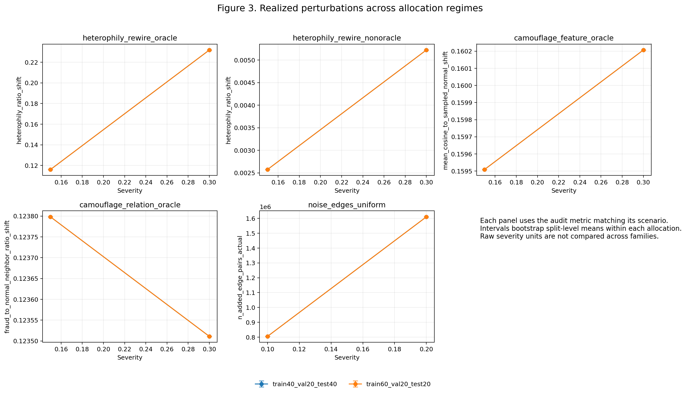
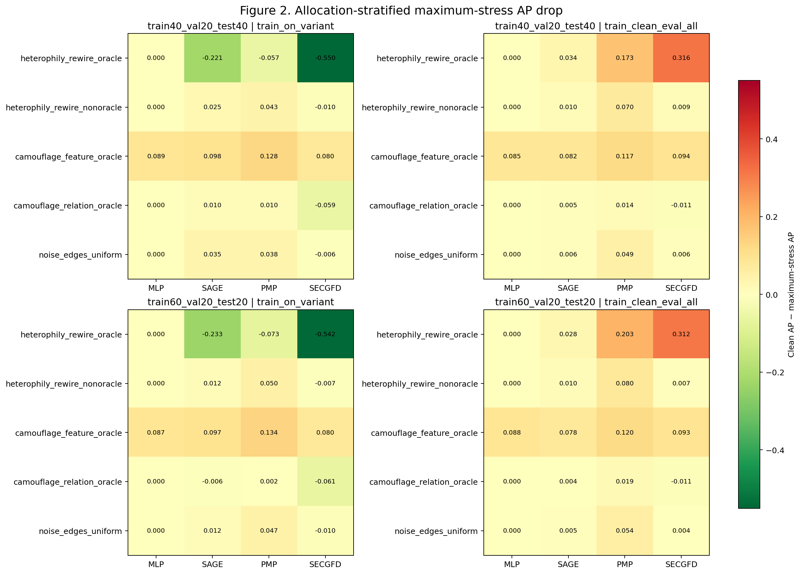
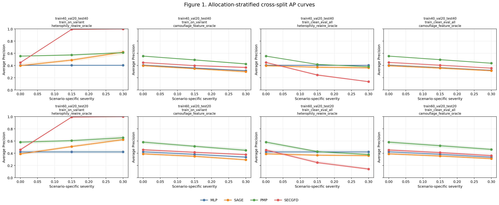

# Full Results Analysis: YelpChi Robustness Benchmark v4 Factorial, Research Run R1

**Analysis date:** 13 July 2026

**Executed notebook:** [KAGGLE_DUAL_T4_RESEARCH_RUN_with_outputs_latest_v4_r1_multi_seeds.ipynb](KAGGLE_DUAL_T4_RESEARCH_RUN_with_outputs_latest_v4_r1_multi_seeds.ipynb)

**Evidence bundle:** [gfd-robustness-v4-factorial-report-r1](gfd-robustness-v4-factorial-report-r1/)

**Purpose:** evidence-first interpretation for the later final project report

## Executive verdict

This is a complete and strongly traceable execution of the v4 factorial YelpChi benchmark. All **5,040 expected evaluations** are present, unique, successful, and represented in the unified results table. The main scientific result is stable across the two label-allocation regimes, both training protocols, three split seeds, five training seeds, and all three reported metrics:

1. **PMP is the strongest detector in absolute terms.** It has the highest clean AP, ROC-AUC, and macro-F1 in every allocation/protocol context. At the maximum severity of the two strictly non-oracle operational stresses, it wins every aggregate comparison for AP, ROC-AUC, and macro-F1. Its max-stress AP lead over the best non-PMP model is 0.0420–0.0787.

2. **High stressed performance and small performance loss are different notions of robustness.** PMP loses more AP than the lower-performing models under unexpected non-oracle graph shifts, yet it normally remains the most useful detector after the shift. The graph-blind MLP has exactly zero response to graph-only interventions, but its absolute AP is materially below PMP.

3. **Feature camouflage is the broadest controlled failure mode.** Complete feature replacement on selected fraud nodes harms every model, including the MLP, and its degradation is monotone with severity. At the tested maximum, AP drops by about 0.078–0.134 depending on model, protocol, and allocation.

4. **PMP benefits from retraining on operational graph variants.** Relative to training clean and evaluating under shift, variant training recovers about 0.028–0.030 AP under non-oracle rewiring and 0.007–0.011 AP under uniform edge noise. This adaptation is useful only when the changed environment is known and retraining is possible.

5. **Oracle rewiring is a diagnostic, not an operational attack ranking.** It uses true labels from the full graph, including test nodes. Under clean-trained shift it severely harms graph-dependent models; under variant training it creates a label-constructed topological signal that SEC-GFD can exploit nearly perfectly. SEC-GFD AP = 1.000 in that setting is evidence of a protocol/construct interaction, not evidence of real-world perfect robustness.

6. **The perturbation audit changes how the results must be read.** Oracle and non-oracle rewiring alter exactly the same number of edges, but maximum oracle rewiring increases true-label heterophily by about 0.232 while maximum non-oracle rewiring increases it by only about 0.005. The latter is a large topology churn test, but only a weak realized true-label-heterophily test.

7. **Relation camouflage is now materially stronger than in v3/R6, but remains mild in performance effect at this budget.** At maximum severity it targets 2,003 fraud nodes, adds roughly 77,000 edges, removes roughly 38,700, and raises their mean fraud-to-normal neighbor ratio by about 0.124. The small model changes therefore have more evidential value than the earlier weak intervention, but they still do not establish general resistance to adaptive relation camouflage.

8. **Optimization instability is a major baseline finding.** GraphSAGE training seed 1 collapses on five of six splits: its clean AP is roughly 0.189–0.197 there, versus about 0.43–0.44 for its other seeds. Omitting that seed changes the MLP/GraphSAGE clean ordering, although PMP remains first and SEC-GFD second. Multi-seed reporting prevented a cherry-picked baseline conclusion.

9. **The 60/20/20 regime is an allocation sensitivity analysis, not a pure learning-curve experiment.** It changes the training allocation, validation/test membership, and test size. PMP and MLP improve on average, GraphSAGE does not, and extra labels do not remove PMP's graph-shift sensitivity.

10. **The experiment supports descriptive, benchmark-specific conclusions, not universal model claims.** Only three split seeds and two independent graph seeds are used; the same perturbation plans repeat across split masks; all models receive a homogeneous graph; PMP and SEC-GFD are feasibility adapters; and the evidence comes from one static dataset.

> **Report-safe central conclusion:** Across six YelpChi split configurations, PMP provided the best clean and non-oracle stressed performance in AP, ROC-AUC, and macro-F1, although its stronger use of graph structure produced larger clean-to-shift losses than graph-insensitive baselines. Complete feature camouflage was the most consistently damaging controlled intervention, while oracle rewiring exposed a large adaptation-versus-shift interaction that must remain a privileged diagnostic rather than an operational model ranking.

All values below are rounded for readability. The linked CSVs retain full precision. For a reported drop, **positive means degradation**: clean metric minus stressed metric. For a protocol contrast, **positive means variant training performed better**: train-on-variant minus train-clean-evaluate-all.

## 1. Scope, evidence hierarchy, and research questions

### 1.1 What this document analyzes

This document analyzes the experiment that actually ran, including notebook outputs, raw result rows, perturbation audits, split-local evidence, derived summaries, figures, logs, manifests, and source snapshots. It does not infer results from a planned configuration, and it does not treat the earlier v3/R6 run as part of the v4 sampling distribution.

The evidence hierarchy is:

1. **Authoritative execution record:** the executed notebook and [kaggle_run_manifest.json](gfd-robustness-v4-factorial-report-r1/kaggle_run_manifest.json).
2. **Raw scientific evidence:** [results.csv](gfd-robustness-v4-factorial-report-r1/results.csv), [graph_variants.csv](gfd-robustness-v4-factorial-report-r1/graph_variants.csv), and [variant_audit.csv](gfd-robustness-v4-factorial-report-r1/variant_audit.csv).
3. **Split-local provenance:** the six archived packages under [split_evidence](gfd-robustness-v4-factorial-report-r1/split_evidence/), including active config, result, ledger, audit, and eviction-receipt hashes.
4. **Derived statistical outputs:** [summary_curves_cross_split.csv](gfd-robustness-v4-factorial-report-r1/plots/summary_curves_cross_split.csv), [performance_drop_max_stress_cross_split.csv](gfd-robustness-v4-factorial-report-r1/plots/performance_drop_max_stress_cross_split.csv), [protocol_contrasts_cross_split.csv](gfd-robustness-v4-factorial-report-r1/plots/protocol_contrasts_cross_split.csv), and [robustness_scores_cross_split.csv](gfd-robustness-v4-factorial-report-r1/plots/robustness_scores_cross_split.csv).
5. **Interpretive context:** [Paper_Summary.md](Paper_Summary.md), [FINAL_PROJECT_GUIDE.md](FINAL_PROJECT_GUIDE.md), and the prior [v3/R6 analysis](GFD_ROBUSTNESS_V3_R6_RESULTS_ANALYSIS.md).

The notebook is the authoritative source snapshot because it embedded the benchmark implementation rather than downloading the current project repository. After normalizing Windows/Unix line endings, the 22 embedded benchmark modules match the current local modules.

### 1.2 Research questions

The run directly supports five questions:

- Which integrated detector has the strongest clean performance on YelpChi?
- Which detector preserves the greatest **absolute utility** when node features or graph neighborhoods become unreliable?
- Which detector shows the smallest **relative degradation**, and is that the same model?
- How do conclusions change between matched variant retraining and an unexpected clean-to-stress deployment shift?
- Do the conclusions survive optimization seeds, graph seeds, split seeds, and a second label-allocation regime?

A sixth question is answered only diagnostically:

- What happens when graph construction itself uses privileged true-label information?

That last question is scientifically useful for understanding failure modes, but it is outside an operational deployment ranking.

## 2. Execution integrity, completeness, and provenance

### 2.1 Notebook execution

The notebook contains 90 cells: 66 code cells and 24 Markdown cells. Every code cell executed exactly once in strict execution-count order 1–66. There are no error outputs or tracebacks.

- First recorded execution: **09:34:21 UTC**
- Final idle state: **18:26:44 UTC**
- End-to-end elapsed time: approximately **8 h 52 m**
- Run-attempt ID: **2026-07-13T09:34:22.166281+00:00**
- Final manifest state: **complete**
- Final notebook state: **FINAL_STATUS=complete**
- Setup regression tests: **16 passed**
- GPU lane tasks: **36/36 succeeded on their first attempt**

The only execution warnings were DGL CPU-affinity notices in PMP-related tasks and one pandas future-warning during concatenation. They did not affect completeness or metric production.

### 2.2 Matrix reconstruction

The design has six split configurations, four models, two protocols, five training seeds, two graph seeds for positive-severity variants, and five stress scenarios.

Per split, the graph ledger contains:

- one canonical clean graph; and
- five scenarios × three configured severities, including zero × two graph seeds.

This yields 31 ledger rows per split and **186 graph/audit rows** overall. The 60 scenario-specific zero-severity aliases are retained for audit traceability but are not evaluated as duplicate clean rows.

The evaluated matrix is:

- 6 splits × [1 clean + 5 scenarios × 2 positive severities × 2 graph seeds]
- = 126 evaluated graph states
- × 5 training seeds
- × 4 models
- × 2 protocols
- = **5,040 result rows**

The actual number of model fits is smaller:

- **2,520** train-on-variant fits, one for each variant/model/training-seed cell;
- **120** clean-trained artifacts, equal to 6 splits × 4 models × 5 training seeds;
- **2,640 total fits**.

The clean-trained artifacts are reused for 21 graph-state evaluations per split. Therefore, the 2,520 clean-shift result rows are evaluations, not independent fits.

A schema detail matters for anyone reproducing joins: canonical clean rows store the split seed (717, 1729, or 3253) in the graph-seed field, while stressed rows store perturbation seed 0 or 1.

### 2.3 Raw and derived artifact validation

The bundle contains **879 files** and occupies about **69.94 MiB**:

- 787 PNGs: 784 plot-stage figures and 3 presentation figures;
- 40 CSVs;
- 36 logs;
- 15 JSON files; and
- 1 README text file.

The unified [results.csv](gfd-robustness-v4-factorial-report-r1/results.csv) has 5,040 rows and 32 columns. Validation found:

- all expected run keys present;
- no duplicate run keys or exact duplicate rows;
- every row has status = ok;
- every error field is empty;
- no missing, infinite, or out-of-range metrics;
- ROC-AUC range 0.40256–1.00000;
- AP range 0.11194–1.00000;
- macro-F1 range 0.43775–1.00000; and
- validation-selected threshold range 0.13777–0.94995.

[missing_or_error_runs.csv](gfd-robustness-v4-factorial-report-r1/plots/missing_or_error_runs.csv) is header-only. The six split-local result tables concatenate to the root results semantically, and the same is true for their graph and audit ledgers. The four stage summaries reproduce from raw results, all 2,160 rows of the within-split curve table reproduce from raw means/SD/counts, and the cross-split summaries reproduce from split-level means.

All 25 artifact hashes listed in the manifest match their actual files. The run fingerprint recomputes from its canonical components, and each split eviction receipt correctly hashes its active config, results, graph ledger, and audit ledger. Across manifest and split-receipt verification, all **49 checksum comparisons** pass.

Protocol lineage also verifies row by row: every train-on-variant result points its training reference to the evaluated graph, every train-clean-evaluate-all result points to the canonical base graph, and all 5,040 embedded graph-statistic records match the graph ledger.

### 2.4 Reproducibility boundary

The main identifiers are:

- Experiment name: **gfd_robustness_benchmark_v4_factorial**
- Notebook implementation: **single-source-v4-factorial-r1-2026-07-13**
- Configuration SHA-256: **77d2215791b18233b2ba3b079431ac09941e0e7528c934649e9793b64245b909**
- Run fingerprint: **e419afb9dcdffa3c922c355b3964e9d06e54164b7bcef01646262a7c2814dd41**
- PMP commit: **3f7629f6c180891a0bc1bba3c66d94d288a1ddae**
- SEC-GFD commit: **97faa51145ed1fbcbdc67cc5d399490da9a9797a**

The light report bundle intentionally excludes the cached dataset, graph binaries, isolated runtime, lane workspaces, smoke outputs, and cloned upstream repositories. Consequently, a reviewer can verify the tabular evidence and regenerate the logical graph variants, but cannot byte-compare regenerated graph binaries against the executed cache. Seeded CUDA execution is also not guaranteed to be bitwise deterministic.

## 3. Dataset, task, and split design

### 3.1 YelpChi profile

The notebook loads YelpChi through DGL's FraudDataset and converts its source heterograph to one homogeneous evaluation graph.

| Property | Value |
|---|---:|
| Nodes | 45,954 |
| Directed edges | 8,051,348 |
| Features per node | 32 |
| Normal nodes | 39,277 |
| Fraud nodes | 6,677 |
| Global fraud prevalence | 14.5297% |
| Mean in/out degree | 175.2045 |
| Median degree | 175 |
| Clean true-label heterophily | 0.226880 |
| Source relations | net_rsr, net_rtr, net_rur |

The prediction task is node-level binary fraud classification. The 14.53% fraud prevalence makes ranking quality for the minority class especially important.

### 3.2 Split regimes

Masks are created by deterministic per-class shuffling. Each allocation regime uses the same three split seeds.

| Regime | Split IDs | Seeds | Train | Validation | Test |
|---|---|---|---:|---:|---:|
| 40/20/40 | r40_s0, r40_s1, r40_s2 | 717, 1729, 3253 | 18,380 | 9,190 | 18,384 |
| 60/20/20 | r60_s0, r60_s1, r60_s2 | 717, 1729, 3253 | 27,572 | 9,190 | 9,192 |

Class counts are:

| Regime | Train normal/fraud | Validation normal/fraud | Test normal/fraud |
|---|---:|---:|---:|
| 40/20/40 | 15,710 / 2,670 | 7,855 / 1,335 | 15,712 / 2,672 |
| 60/20/20 | 23,566 / 4,006 | 7,855 / 1,335 | 7,856 / 1,336 |

The matched split seeds are useful for paired sensitivity analysis, but the regimes do **not** hold the evaluation cohort fixed. In the same class-wise shuffle:

- the 40–60% segment moves from validation in the 40% regime to training in the 60% regime;
- the 60% regime's validation portion comes from the first half of the 40% regime's test portion; and
- the 60% test set is the final half/subset of the 40% test set.

Therefore, a 60-minus-40 difference mixes additional training labels, different validation membership, different test membership, and a smaller test set. It must not be described as the causal benefit of adding 20 percentage points of labels.

Both test regimes retain approximately the same stratified fraud prevalence: 2,672/18,384 and 1,336/9,192 are each about 14.534%.

### 3.3 Metrics and decision rule

Three test metrics are reported:

- **Average Precision (AP):** the primary metric because it emphasizes minority-class precision-recall ranking under imbalance. A no-skill reference is near the test fraud prevalence, approximately 0.145.
- **ROC-AUC:** a threshold-free ranking metric that is less directly sensitive to prevalence and can look optimistic when negatives dominate.
- **Macro-F1:** the mean of class-wise F1 values at one validation-selected threshold; it exposes operating-point behavior but depends on the chosen validation threshold.

Early stopping monitors validation ROC-AUC. The classification threshold is chosen by maximizing validation macro-F1 and is then frozen for test evaluation. Model fitting and threshold selection do not use test outcomes.

The exception is scenario construction: oracle perturbations use full-graph labels, including labels of test nodes. That is why oracle rows have explicit diagnostic claim scopes and are excluded from operational ranking.

## 4. System and methods as actually executed

### 4.1 Shared graph view

All four models receive the same homogeneous DGL graph. This improves benchmark comparability, but collapses YelpChi's three relation types into one edge type. The result is a comparison of integrated benchmark implementations, not a comparison of each research model in its richest native multi-relational setting.

### 4.2 Integrated models

| Model | Executed configuration | Main interpretive role |
|---|---|---|
| MLP | 32→128→128→2; ReLU; dropout 0.5; Adam lr 0.001, weight decay 0.0005; up to 100 epochs; patience 10; full-batch weighted cross-entropy | Graph-blind feature baseline and negative control for graph-only perturbations |
| GraphSAGE | Two mean-aggregation SAGEConv layers; hidden 64; dropout 0.5; Adam lr 0.01, weight decay 0.0005; up to 100 epochs; patience 10; full-graph weighted cross-entropy | Conventional neighborhood-aggregation baseline |
| PMP / LA-SAGE-S adapter | One layer; hidden 48; dropout 0; incoming sampling fanout 10; batch 512; projection; row-normalized features; mean aggregation; Adam lr 0.01; no weight decay; up to 100 epochs; patience 10; unweighted loss; Windows-safe workers = 0 | Feasibility integration of partitioned message passing |
| SEC-GFD adapter | Hidden 32; polynomial order 2; high-order term 1; contrastive coefficient 0.2; Adam lr 0.01; no weight decay; 50-epoch default; patience 10; weighted cross-entropy plus 0.2 × NCE; full graph | Reduced-cost spectral/environmental-constraint feasibility integration |

PMP sees only the homogeneous graph's single edge type and therefore cannot exercise the paper's full relation-aware design. Optional PyG normalization components unavailable in the runtime are replaced by identity modules. SEC-GFD uses a zero-in-degree GraphConv compatibility setting. These are material scope limitations: the results compare **these adapters**, not faithful reproductions of every published configuration.

### 4.3 Training protocols

| Protocol | Training graph | Evaluation graphs | Threshold | Scientific meaning |
|---|---|---|---|---|
| train_on_variant | Each clean or stressed variant | The matching variant | Selected on that variant's validation mask | Adaptation when the environment is known during training |
| train_clean_eval_all | Canonical clean graph only | Clean and every stressed variant | Selected on clean validation and reused | Unexpected deployment shift without retraining |

The protocols answer different questions. A model can be easy to adapt but fragile to sudden shift, or stable under shift but unable to exploit a known changed environment. Neither protocol should replace the other.

### 4.4 Stress scenarios and claim scope

| Scenario | Positive severities | Mechanism | Uses true labels? | Correct claim scope |
|---|---|---|---|---|
| heterophily_rewire_oracle | 0.15, 0.30 | Rewire selected relation-edge destinations toward opposite-label nodes | Yes, all nodes | Shift-sensitivity or privileged-training diagnostic |
| heterophily_rewire_nonoracle | 0.15, 0.30 | Rewire with a feature-derived two-means pseudo partition fixed within a graph seed | No | Controlled non-oracle operational stress |
| camouflage_feature_oracle | 0.15, 0.30 | Select fraud nodes and completely replace their features with sampled normal-node features | Yes | Controlled feature-camouflage diagnostic |
| camouflage_relation_oracle | 0.15, 0.30 | Select fraud nodes, add normal neighbors, remove some fraud neighbors | Yes | Controlled relation-camouflage diagnostic |
| noise_edges_uniform | 0.10, 0.20 | Add uniformly sampled directed relation edges | No | Controlled non-oracle operational stress |

Graph perturbation seeds are 0 and 1; optimization seeds are 0–4. Rewiring rejects self-loops, existing edges, and duplicates, with a maximum-attempt multiplier of 20. Uniform noise is allocated proportionally across source relations. Relation camouflage adds ceil(0.25 × out-degree) edges per selected node, clamped to 4–64, and removes floor(0.5 × realized additions) suspicious fraud-to-fraud edges.

The strict operational ranking in this document uses only **non-oracle rewiring and uniform edge noise**. Feature and relation camouflage remain important mechanistic diagnostics, but their target selection is oracle-assisted. Oracle rewiring is separated even more strongly because matched training can turn the label-derived topology into privileged predictive information.

## 5. Statistical estimands and interpretation rules

### 5.1 Experimental units

For a positive-severity graph state within one split:

- two graph seeds generate two perturbation realizations;
- five training seeds generate five optimization realizations; and
- the full crossed cell contains ten evaluations per model/protocol.

The clean graph has five true optimization-seed evaluations. It is reused as the paired baseline for both stressed graph seeds; duplicated clean references are not treated as independent clean fits.

At allocation-regime level, the reported cross-split mean averages three split-level means. The same graph perturbation plan is deliberately reused across all six split masks for a given scenario/severity/graph-seed combination. This controls the graph intervention while masks vary, but means there are only two independent perturbation plans—not six.

### 5.2 Uncertainty construction

The plots stage uses:

- 1,000 bootstrap resamples;
- bootstrap seed 0;
- 2.5th and 97.5th percentiles;
- crossed graph-seed/training-seed resampling within a split;
- paired resampling for clean-to-stress drops, retention, and protocol contrasts; and
- resampling of three split-level means for cross-split summaries.

With only three split means and two graph seeds, these intervals are best read as **descriptive sensitivity bands**, not precise population confidence intervals or formal significance tests. No multiple-comparison correction or preregistered hypothesis test is present.

### 5.3 Quantities used in this analysis

- **Stressed performance:** the metric at a specified positive severity.
- **Drop:** clean metric minus stressed metric. Positive is worse; negative means the stressed score is higher.
- **Retention:** stressed metric divided by clean metric.
- **Protocol contrast:** variant-trained score minus clean-trained-shift score.
- **Robustness AUC:** trapezoidal area under metric versus configured severity.
- **Normalized robustness:** robustness AUC divided by the scenario's severity span.

Raw robustness AUC is not comparable across all scenarios because uniform noise spans 0–0.20 while the other scenarios span 0–0.30. Cross-scenario comparisons must use the normalized average metric, not raw area.

Severity levels also have different physical meanings across scenarios. A severity of 0.30 can mean a fraction of selected nodes or edges, while noise severity 0.20 controls added edge volume. The variants at successive severities are deterministic but not guaranteed to be nested supersets, so small non-monotonic movements should not automatically be described as a violated dose-response law.

## 6. Perturbation realization: what was actually changed?

The perturbation audit is essential because configured severity is only an instruction; the realized topology or feature change is the scientific treatment. Every applicable requested count equals its realized count. No scenario saturated or silently under-delivered its requested nodes, additions, removals, edge pairs, or rewires.

| Scenario | Severity | Realized intervention | Realized construct change |
|---|---:|---|---|
| Feature camouflage, oracle | 0.15 | 1,001 fraud nodes replaced | Mean cosine to sampled normal: 0.84049 → 1.00000; graph unchanged |
| Feature camouflage, oracle | 0.30 | 2,003 fraud nodes replaced | Mean cosine: 0.83979 → 1.00000; mean shift about 0.16021 |
| Relation camouflage, oracle | 0.15 | 1,001 nodes; 38,443–39,764 additions; half as many removals | Selected fraud-to-normal ratio about 0.8104 → 0.9342; global heterophily +0.00430 |
| Relation camouflage, oracle | 0.30 | 2,003 nodes; 77,163–77,540 additions; 38,581–38,770 removals | Selected ratio about 0.8174 → 0.9410; global heterophily +0.00848 |
| Non-oracle rewiring | 0.15 | 1,207,702 edges rewired | True-label heterophily +0.00257 |
| Non-oracle rewiring | 0.30 | 2,415,404 edges rewired | True-label heterophily +0.00522 |
| Oracle rewiring | 0.15 | 1,207,702 edges rewired | True-label heterophily +0.11604 |
| Oracle rewiring | 0.30 | 2,415,404 edges rewired | True-label heterophily +0.23186; final ratio about 0.45875 |
| Uniform edge noise | 0.10 | 805,134 edges added | Heterophily +0.00202; about 8.856M total edges |
| Uniform edge noise | 0.20 | 1,610,269 edges added | Heterophily +0.00357; 9,661,617 total edges |

### 6.1 Equal edge churn does not mean equal semantic stress

Maximum oracle and non-oracle rewiring both change exactly 2,415,404 edge destinations. Yet oracle rewiring shifts true-label heterophily by 0.23186, while non-oracle rewiring shifts it by only 0.00522: roughly a 44-fold difference. The feature-derived pseudo partition is therefore weakly aligned with true labels.

The correct interpretation is:

- non-oracle rewiring is a strong **edge-churn/neighborhood-replacement** stress;
- it is only a weak realized **true-label-heterophily** stress; and
- oracle rewiring is a strong but privileged label-topology diagnostic.

Reporting only the number of rewired edges would hide this central construct-validity result.

The feature two-means partition's pseudo-positive rate is about 37.10%, far from the true 14.53% fraud prevalence. This helps explain why pseudo-opposite rewiring is not equivalent to true opposite-label rewiring. Oracle rewiring also preserves edge count and source out-degree but redistributes destinations: median in-degree falls from about 175 to 149 at severity 0.30. Its effect is therefore not a perfectly isolated causal manipulation of heterophily; it combines label-coded topology with destination-degree redistribution.

### 6.2 Feature and relation camouflage measure different exposure

Both oracle camouflage scenarios select the same number of fraud nodes at a given severity. Feature camouflage replaces all 32 attributes of each selected node with a sampled normal node's attributes. Its per-node change is complete and directly attacks every feature-using model.

Relation camouflage expands and alters the neighborhoods of selected nodes. At severity 0.30, it produces about 38,700 net new edges—roughly 0.48% of the base graph—and changes the selected nodes' neighbor composition substantially. The per-selected-node fraud-to-normal ratio shift is similar at the two severities; severity mainly doubles the number of exposed nodes. Therefore, a plot of the mean per-node ratio shift alone understates the doubled population scope.

### 6.3 Split-independent construction verified

For the same scenario, severity, and graph seed, every audit column is identical across all six split configurations. This directly verifies that perturbation construction is independent of the train/validation/test masks. It is a design strength for paired split comparisons, while also explaining why allocation lines and audit intervals overlap.

**Figure interpretation.** The orange 60/20/20 lines visually cover the blue 40/20/40 lines because the graph perturbations are identical across allocation masks. Panel y-axes use different physical units and must not be compared as a common magnitude scale. For feature and relation camouflage, the shown y-axis is a per-selected-node effect; the number of selected nodes still doubles from severity 0.15 to 0.30.

## 7. Clean performance

The following tables use allocation-level cross-split means and the reported split-bootstrap intervals. Since each interval is based on only three split-level means, it should be read as an observed split-sensitivity band.

### 7.1 Clean results: 40/20/40

| Model and protocol | AP | ROC-AUC | Macro-F1 |
|---|---:|---:|---:|
| MLP, clean-trained | 0.4060 [0.3999, 0.4112] | 0.7824 [0.7797, 0.7875] | 0.6538 [0.6503, 0.6583] |
| MLP, variant-trained | 0.4060 [0.3999, 0.4112] | 0.7824 [0.7797, 0.7875] | 0.6538 [0.6503, 0.6583] |
| GraphSAGE, clean-trained | 0.3982 [0.3818, 0.4294] | 0.7649 [0.7496, 0.7924] | 0.6490 [0.6375, 0.6707] |
| GraphSAGE, variant-trained | 0.3992 [0.3834, 0.4306] | 0.7651 [0.7494, 0.7926] | 0.6497 [0.6382, 0.6708] |
| **PMP, clean-trained** | **0.5553 [0.5522, 0.5573]** | **0.8456 [0.8451, 0.8466]** | **0.7175 [0.7168, 0.7180]** |
| **PMP, variant-trained** | **0.5553 [0.5522, 0.5573]** | **0.8456 [0.8451, 0.8466]** | **0.7175 [0.7168, 0.7180]** |
| SEC-GFD, clean-trained | 0.4521 [0.4510, 0.4541] | 0.8011 [0.7998, 0.8030] | 0.6754 [0.6737, 0.6784] |
| SEC-GFD, variant-trained | 0.4498 [0.4456, 0.4547] | 0.7999 [0.7965, 0.8024] | 0.6746 [0.6725, 0.6772] |

### 7.2 Clean results: 60/20/20

| Model and protocol | AP | ROC-AUC | Macro-F1 |
|---|---:|---:|---:|
| MLP, either protocol | 0.4240 [0.4016, 0.4495] | 0.7905 [0.7724, 0.8043] | 0.6566 [0.6440, 0.6651] |
| GraphSAGE, clean-trained | 0.3903 [0.3749, 0.4054] | 0.7562 [0.7435, 0.7655] | 0.6398 [0.6302, 0.6452] |
| GraphSAGE, variant-trained | 0.3901 [0.3736, 0.4052] | 0.7560 [0.7431, 0.7651] | 0.6396 [0.6295, 0.6449] |
| **PMP, either protocol** | **0.5825 [0.5567, 0.6044]** | **0.8536 [0.8412, 0.8606]** | **0.7267 [0.7146, 0.7349]** |
| SEC-GFD, clean-trained | 0.4540 [0.4429, 0.4725] | 0.8020 [0.7901, 0.8112] | 0.6737 [0.6654, 0.6780] |
| SEC-GFD, variant-trained | 0.4580 [0.4464, 0.4735] | 0.8037 [0.7917, 0.8118] | 0.6746 [0.6662, 0.6793] |

### 7.3 Clean-result interpretation

PMP is unambiguously first and SEC-GFD second. At individual split level, PMP ranks first and SEC-GFD second in every split × protocol cell for each of AP, ROC-AUC, and macro-F1. The MLP and GraphSAGE ordering is weaker: MLP is third in most aggregate cells, but this is substantially affected by one failing GraphSAGE optimization seed.

PMP's clean AP advantage over SEC-GFD is about:

- 0.103–0.106 in the 40/20/40 regime; and
- 0.124–0.129 in the 60/20/20 regime.

The MLP's clean AP is competitive with or greater than GraphSAGE despite ignoring the graph. This is an important baseline result: mean neighborhood aggregation does not automatically add useful information on the homogeneous YelpChi view.

MLP and PMP clean results match exactly between protocols because their clean artifacts align exactly. Small GraphSAGE and SEC-GFD differences remain even though the nominal clean graph and training seeds match. Their mean absolute clean AP differences are only 0.00169 and 0.00555, respectively; separate execution paths or CUDA nondeterminism are plausible explanations. These tiny clean offsets are not protocol treatment effects.

## 8. Maximum-severity Average Precision

Each cell below is **stressed AP (clean AP − stressed AP)**. Positive values in parentheses indicate degradation. The bold value is the highest stressed AP in that row.

### 8.1 40/20/40, train clean and evaluate all

| Scenario | MLP | GraphSAGE | PMP | SEC-GFD |
|---|---:|---:|---:|---:|
| Feature camouflage, oracle diagnostic | 0.3215 (+0.0845) | 0.3161 (+0.0821) | **0.4387 (+0.1165)** | 0.3579 (+0.0942) |
| Relation camouflage, oracle diagnostic | 0.4060 (+0.0000) | 0.3930 (+0.0052) | **0.5412 (+0.0140)** | 0.4628 (−0.0107) |
| Non-oracle rewiring, operational | 0.4060 (+0.0000) | 0.3881 (+0.0101) | **0.4849 (+0.0704)** | 0.4429 (+0.0092) |
| Oracle rewiring, privileged diagnostic | **0.4060 (+0.0000)** | 0.3639 (+0.0343) | 0.3823 (+0.1730) | 0.1365 (+0.3156) |
| Uniform edge noise, operational | 0.4060 (+0.0000) | 0.3922 (+0.0061) | **0.5062 (+0.0491)** | 0.4466 (+0.0056) |

### 8.2 40/20/40, train on each variant

| Scenario | MLP | GraphSAGE | PMP | SEC-GFD |
|---|---:|---:|---:|---:|
| Feature camouflage, oracle diagnostic | 0.3171 (+0.0889) | 0.3009 (+0.0983) | **0.4271 (+0.1282)** | 0.3700 (+0.0798) |
| Relation camouflage, oracle diagnostic | 0.4060 (+0.0000) | 0.3894 (+0.0098) | **0.5451 (+0.0102)** | 0.5084 (−0.0586) |
| Non-oracle rewiring, operational | 0.4060 (+0.0000) | 0.3740 (+0.0252) | **0.5127 (+0.0426)** | 0.4594 (−0.0096) |
| Oracle rewiring, privileged diagnostic | 0.4060 (+0.0000) | 0.6207 (−0.2215) | 0.6124 (−0.0572) | **1.0000 (−0.5502)** |
| Uniform edge noise, operational | 0.4060 (+0.0000) | 0.3640 (+0.0352) | **0.5175 (+0.0378)** | 0.4562 (−0.0065) |

### 8.3 60/20/20, train clean and evaluate all

| Scenario | MLP | GraphSAGE | PMP | SEC-GFD |
|---|---:|---:|---:|---:|
| Feature camouflage, oracle diagnostic | 0.3359 (+0.0881) | 0.3122 (+0.0781) | **0.4629 (+0.1195)** | 0.3614 (+0.0925) |
| Relation camouflage, oracle diagnostic | 0.4240 (+0.0000) | 0.3868 (+0.0036) | **0.5636 (+0.0188)** | 0.4654 (−0.0115) |
| Non-oracle rewiring, operational | 0.4240 (+0.0000) | 0.3804 (+0.0100) | **0.5022 (+0.0803)** | 0.4467 (+0.0073) |
| Oracle rewiring, privileged diagnostic | **0.4240 (+0.0000)** | 0.3625 (+0.0278) | 0.3792 (+0.2033) | 0.1415 (+0.3125) |
| Uniform edge noise, operational | 0.4240 (+0.0000) | 0.3849 (+0.0054) | **0.5287 (+0.0538)** | 0.4500 (+0.0040) |

### 8.4 60/20/20, train on each variant

| Scenario | MLP | GraphSAGE | PMP | SEC-GFD |
|---|---:|---:|---:|---:|
| Feature camouflage, oracle diagnostic | 0.3371 (+0.0869) | 0.2935 (+0.0967) | **0.4488 (+0.1337)** | 0.3781 (+0.0799) |
| Relation camouflage, oracle diagnostic | 0.4240 (+0.0000) | 0.3960 (−0.0059) | **0.5809 (+0.0016)** | 0.5194 (−0.0614) |
| Non-oracle rewiring, operational | 0.4240 (+0.0000) | 0.3782 (+0.0120) | **0.5321 (+0.0504)** | 0.4655 (−0.0075) |
| Oracle rewiring, privileged diagnostic | 0.4240 (+0.0000) | 0.6234 (−0.2333) | 0.6550 (−0.0725) | **1.0000 (−0.5420)** |
| Uniform edge noise, operational | 0.4240 (+0.0000) | 0.3778 (+0.0124) | **0.5355 (+0.0470)** | 0.4675 (−0.0095) |

### 8.5 Winner structure

Across the 20 allocation × protocol × scenario cells:

- PMP wins 16;
- MLP wins the two clean-trained oracle-rewiring cells because it ignores the graph; and
- SEC-GFD wins the two variant-trained oracle-rewiring cells by exploiting the label-constructed topology.

The same winner pattern holds for ROC-AUC and macro-F1. Restricting to the eight strictly operational maximum-stress cells, PMP wins **8/8 for each metric**. Across both positive severity levels, PMP also wins all **16/16 aggregate operational AP cells**. At the finer split level and maximum stress, PMP ranks first and SEC-GFD second in all 72 operational comparisons: 6 splits × 2 protocols × 2 scenarios × 3 metrics.

**Figure interpretation.** This is the best compact overview of scenario and protocol interactions. The shared color scale is dominated by the extreme oracle SEC-GFD values around −0.55 and +0.31, which visually compresses operational differences near zero. In the final report, this figure should be paired with an operational-only table or a second heatmap that excludes oracle rows.

## 9. Strictly operational robustness

The operational subset contains non-oracle rewiring and uniform edge noise. The next table averages the two maximum-severity AP values equally.

| Regime/protocol | Model | Clean AP | Mean operational stressed AP | Drop | Retention |
|---|---|---:|---:|---:|---:|
| 40, clean-trained shift | MLP | 0.4060 | 0.4060 | 0.0000 | 100.00% |
| 40, clean-trained shift | GraphSAGE | 0.3982 | 0.3901 | 0.0081 | 97.97% |
| 40, clean-trained shift | **PMP** | 0.5553 | **0.4955** | 0.0597 | 89.24% |
| 40, clean-trained shift | SEC-GFD | 0.4521 | 0.4447 | 0.0074 | 98.37% |
| 40, variant-trained | MLP | 0.4060 | 0.4060 | 0.0000 | 100.00% |
| 40, variant-trained | GraphSAGE | 0.3992 | 0.3690 | 0.0302 | 92.43% |
| 40, variant-trained | **PMP** | 0.5553 | **0.5151** | 0.0402 | 92.76% |
| 40, variant-trained | SEC-GFD | 0.4498 | 0.4578 | −0.0080 | 101.79% |
| 60, clean-trained shift | MLP | 0.4240 | 0.4240 | 0.0000 | 100.00% |
| 60, clean-trained shift | GraphSAGE | 0.3903 | 0.3827 | 0.0077 | 98.04% |
| 60, clean-trained shift | **PMP** | 0.5825 | **0.5155** | 0.0670 | 88.49% |
| 60, clean-trained shift | SEC-GFD | 0.4540 | 0.4483 | 0.0056 | 98.76% |
| 60, variant-trained | MLP | 0.4240 | 0.4240 | 0.0000 | 100.00% |
| 60, variant-trained | GraphSAGE | 0.3901 | 0.3780 | 0.0122 | 96.88% |
| 60, variant-trained | **PMP** | 0.5825 | **0.5338** | 0.0487 | 91.64% |
| 60, variant-trained | SEC-GFD | 0.4580 | 0.4665 | −0.0085 | 101.86% |

Three conclusions must be kept together:

1. **PMP has the greatest absolute stressed AP.**
2. **PMP has the largest clean-to-stress AP loss under unexpected operational shift.**
3. **MLP has perfect graph invariance but lower absolute utility.**

A robustness report that shows only retention would favor the MLP and SEC-GFD; one that shows only stressed AP would favor PMP. Reporting clean score, stressed score, drop, and retention together prevents either incomplete conclusion.

At operational maximum stress, PMP's AP advantage over the best non-PMP model ranges from 0.0420 to 0.0787. The PMP-minus-runner-up difference is positive in all three split replicates for every operational regime/protocol/scenario cell.

PMP's paired maximum-stress AP drops and reported split-bootstrap bands are:

| Regime/protocol | Non-oracle rewiring drop | Uniform-noise drop |
|---|---:|---:|
| 40, clean-trained shift | 0.0704 [0.0637, 0.0755] | 0.0491 [0.0445, 0.0533] |
| 40, variant-trained | 0.0426 [0.0348, 0.0485] | 0.0378 [0.0342, 0.0437] |
| 60, clean-trained shift | 0.0803 [0.0725, 0.0898] | 0.0538 [0.0516, 0.0552] |
| 60, variant-trained | 0.0504 [0.0444, 0.0537] | 0.0470 [0.0450, 0.0496] |

These bands show consistent direction in the three observed split means, but remain descriptive because n = 3.

### 9.1 Severity-integrated operational robustness

The normalized robustness score is the average metric over each severity curve. Averaging the two operational normalized AP scores gives:

| Regime/protocol | MLP | GraphSAGE | PMP | SEC-GFD |
|---|---:|---:|---:|---:|
| 40, clean-trained shift | 0.4060 | 0.3937 | **0.5204** | 0.4482 |
| 40, variant-trained | 0.4060 | 0.3754 | **0.5290** | 0.4545 |
| 60, clean-trained shift | 0.4240 | 0.3860 | **0.5436** | 0.4515 |
| 60, variant-trained | 0.4240 | 0.3823 | **0.5523** | 0.4640 |

PMP remains first when the entire operational severity trajectory is summarized, not only at the endpoint.

## 10. Scenario-by-scenario interpretation

### 10.1 Feature camouflage: broad and monotone damage

Feature camouflage is the only intervention that can affect the graph-blind MLP, and it does so consistently. At maximum severity:

- shift-protocol AP drops range from 0.0781 to 0.1195;
- variant-training AP drops range from 0.0798 to 0.1337;
- ROC-AUC drops range roughly from 0.075 to 0.093; and
- macro-F1 drops range roughly from 0.037 to 0.059.

The feature curve is monotone degrading for every model, allocation, and protocol. Representative PMP sequences are:

- 40/20/40 clean-trained: 0.5553 → 0.4968 → 0.4387;
- 60/20/20 clean-trained: 0.5825 → 0.5236 → 0.4629.

At maximum severity, relation-camouflage AP is 0.0745–0.1413 higher than feature-camouflage AP in every model/context. Under these exact interventions, replacing fraud features is therefore more damaging than changing their relation neighborhoods.

This is a controlled worst-case mechanism, not a natural attack prevalence estimate: true labels choose the targeted fraud nodes and their features are fully replaced. It supports the claim that feature reliability is a shared dependency, not the claim that 30% of real fraudsters can perfectly copy normal attributes.

### 10.2 Non-oracle rewiring: meaningful neighborhood churn, weak heterophily shift

Under unexpected shift, PMP's maximum AP drop is 0.0704 in 40/20/40 and 0.0803 in 60/20/20. Yet its stressed AP remains 0.4849 and 0.5022, higher than all alternatives. Variant retraining improves PMP to 0.5127 and 0.5321.

GraphSAGE and SEC-GFD have much smaller clean-shift drops, but lower absolute AP. The MLP is exactly invariant. This pattern is consistent with a graph-use tradeoff: PMP extracts more value from the clean graph and therefore has more graph-derived performance to lose.

The audit prevents a stronger statement. Despite rewiring 30% of eligible edges, true-label heterophily rises only 0.00522. This scenario should be called non-oracle neighborhood rewiring or churn—not strong achieved heterophily.

### 10.3 Uniform edge noise: density shift with the same ranking

Maximum noise adds 1.61 million directed edges, increasing graph size by 20%. Under unexpected shift:

- PMP drops 0.0491 AP in 40/20/40 and 0.0538 in 60/20/20;
- GraphSAGE drops 0.0061 and 0.0054;
- SEC-GFD drops 0.0056 and 0.0040; and
- MLP remains unchanged.

PMP still has the best stressed AP: 0.5062 and 0.5287. Variant training recovers some PMP performance, reaching 0.5175 and 0.5355. GraphSAGE variant training is less stable and degrades more than its frozen clean-trained counterpart.

The result indicates that neighborhood density and uninformative messages matter most in relative terms for the model that benefits most from graph information. It does not imply PMP is the least useful noisy-graph detector; it remains the strongest in absolute terms.

### 10.4 Relation camouflage: a stronger audit, a modest metric effect

The v4 intervention materially changes selected fraud neighborhoods. At maximum severity it adds roughly 77,000 normal-directed edges, removes roughly 38,700 fraud-directed edges, and raises the selected fraud-to-normal neighbor ratio from about 0.817 to 0.941.

Nevertheless:

- MLP remains exactly unchanged, as expected;
- GraphSAGE AP changes are between a 0.0098 loss and a 0.0059 gain;
- PMP loses 0.0016–0.0188 AP; and
- SEC-GFD improves by about 0.011–0.061 AP depending on protocol/allocation.

The tested mechanism is therefore not highly damaging to these adapters at this budget. Because selection uses labels and the intervention is not adaptive to each detector, the safe conclusion is narrow: **this configured relation-camouflage treatment produced small AP effects**. General claims that relation camouflage is harmless remain unsupported.

### 10.5 Oracle rewiring: topology-regime reversal

Oracle rewiring produces the largest interaction in the experiment.

| Model | 40 clean-trained AP | 40 variant-trained AP | 60 clean-trained AP | 60 variant-trained AP |
|---|---:|---:|---:|---:|
| MLP | 0.4060 | 0.4060 | 0.4240 | 0.4240 |
| GraphSAGE | 0.3639 | 0.6207 | 0.3625 | 0.6234 |
| PMP | 0.3823 | 0.6124 | 0.3792 | 0.6550 |
| SEC-GFD | 0.1365 | **1.0000** | 0.1415 | **1.0000** |

Under clean-trained shift, SEC-GFD falls to ROC-AUC 0.4736/0.4917, AP 0.1365/0.1415, and macro-F1 about 0.480—near or below the fraud-prevalence AP reference and near-random ROC ranking. Under variant training, it reaches ROC-AUC 1.000, AP approximately 1.000, and macro-F1 approximately 0.9998.

The raw table contains 56 rows with exactly perfect ROC-AUC and AP, all SEC-GFD runs trained on severity-0.30 oracle-rewired graphs. This is best explained as privileged graph-label signal: the topology was constructed using labels from all nodes, including test nodes, and SEC-GFD learned that artificial regime. It does not prove robustness and must never be presented in the operational leaderboard.

**Figure interpretation.** The figure clearly shows monotone feature damage and the oracle protocol reversal, but it includes only feature camouflage and oracle rewiring. It does not show either strictly operational scenario, so it cannot serve as the sole robustness-results figure.

## 11. Direct protocol contrasts

### 11.1 Operational adaptation

The table reports AP contrast = train-on-variant minus train-clean-evaluate-all at maximum stress. Brackets are the reported split-bootstrap intervals.

| Allocation/scenario | MLP | GraphSAGE | PMP | SEC-GFD |
|---|---:|---:|---:|---:|
| 40, non-oracle rewire | 0.0000 | −0.0141 [−0.0379, −0.0006] | **+0.0278 [+0.0192, +0.0371]** | +0.0165 [+0.0077, +0.0286] |
| 40, uniform noise | 0.0000 | −0.0281 [−0.0766, −0.0037] | **+0.0113 [+0.0008, +0.0178]** | +0.0097 [−0.0006, +0.0205] |
| 60, non-oracle rewire | 0.0000 | −0.0022 [−0.0066, +0.0020] | **+0.0298 [+0.0252, +0.0361]** | +0.0188 [+0.0091, +0.0311] |
| 60, uniform noise | 0.0000 | −0.0072 [−0.0101, −0.0052] | **+0.0068 [+0.0056, +0.0083]** | +0.0176 [+0.0119, +0.0267] |

PMP adapts positively in all four operational cells, and the same direction holds for ROC-AUC and macro-F1. SEC-GFD usually adapts positively as well. GraphSAGE is harmed or unchanged by matched variant retraining, which is consistent with its larger optimization instability rather than with a general benefit from exposure to stressed graphs.

These are paired benchmark contrasts, not deployment guarantees. Variant training assumes the changed graph is available, labels/masks remain usable, and the model can be retrained and revalidated.

### 11.2 Diagnostic protocol interactions

The largest oracle-rewiring AP contrasts are:

- PMP: +0.2301 in 40/20/40 and +0.2758 in 60/20/20;
- GraphSAGE: +0.2568 and +0.2609; and
- SEC-GFD: +0.8635 and +0.8585.

Feature-camouflage retraining does not uniformly recover performance: PMP and GraphSAGE are often slightly worse with variant training, while SEC-GFD is modestly better. Relation-camouflage retraining improves SEC-GFD by roughly 0.046–0.054 AP. These are controlled mechanism effects, not operational comparisons, because the graph/feature variants use true labels during construction.

### 11.3 Clean-offset caution

Protocol contrasts for MLP and PMP start from exactly zero on the clean graph. GraphSAGE and SEC-GFD have small nonzero clean offsets from separate executions. When interpreting their stressed protocol contrasts, the paired clean-to-stress drop comparison is more defensible than treating the raw stressed difference as entirely caused by protocol.

## 12. Severity trajectories, secondary metrics, and worst cases

### 12.1 Curve behavior

Across 80 cross-split AP curves:

- 46 are nonincreasing;
- 16 are exactly flat, all MLP graph-only curves;
- 13 are nondecreasing, mostly variant-trained oracle/relation cases; and
- 5 are nonmonotonic.

Feature camouflage is consistently monotone decreasing. Oracle rewiring is monotone decreasing under clean-trained shift and sharply increasing for graph models under matched retraining. Operational shift curves mostly decline; small retraining non-monotonicity should be interpreted with the independent-realization and limited-seed caveats.

### 12.2 Metric agreement

The winner pattern is identical across AP, ROC-AUC, and macro-F1. In raw operational rows, pairwise metric correlations are high:

- AP–ROC-AUC: 0.966;
- AP–macro-F1: 0.987; and
- ROC-AUC–macro-F1: 0.975.

This corroboration makes the PMP operational ranking less dependent on a single metric. AP should still lead the report because it is most directly aligned with minority fraud retrieval. Macro-F1 represents only one validation-selected operating point; it is not a full calibration or business-cost analysis.

PMP's operational clean-shift loss is often more visible in AP than in ROC-AUC or macro-F1. For example, its 40/20/40 non-oracle rewiring losses are about 0.0704 AP, 0.0319 ROC-AUC, and 0.0336 macro-F1. This shows why ROC-AUC alone would understate operational degradation.

### 12.3 Robustness-area interpretation

[robustness_scores_cross_split.csv](gfd-robustness-v4-factorial-report-r1/plots/robustness_scores_cross_split.csv) reports both raw area and span-normalized average metric. The normalized value exactly equals raw area divided by the scenario's maximum severity. Only the normalized value is suitable for comparing a 0.20-span noise curve with a 0.30-span camouflage/rewiring curve.

Even normalized scores do not make scenario severities semantically equivalent: they average performance over each scenario's configured path, not over a universal perturbation budget.

### 12.4 Global worst-case artifact is not operational

Every row selected by [worst_case_performance_cross_split.csv](gfd-robustness-v4-factorial-report-r1/plots/worst_case_performance_cross_split.csv) is an oracle scenario and has operational-ranking eligibility set to false. A headline “worst-case” table copied directly from that artifact would mix privileged diagnostics with deployable stress.

The final report should present two envelopes:

- an **operational envelope** filtered to non-oracle rewiring and uniform noise; and
- a clearly labeled **oracle diagnostic envelope** in a separate subsection or appendix.

Zero-severity clean references repeated across scenarios in curve tables must also not be pooled as independent clean measurements.

## 13. Optimization-seed, graph-seed, and split variability

### 13.1 Optimization variability dominates

Median stressed AP standard deviation across the five training seeds is:

| Protocol | MLP | GraphSAGE | PMP | SEC-GFD |
|---|---:|---:|---:|---:|
| Clean-trained shift | 0.0423 | 0.0926 | 0.0131 | 0.0242 |
| Variant-trained | 0.0423 | 0.0957 | 0.0118 | 0.0233 |

PMP is not only the strongest model; its seed dispersion is the smallest in this summary. GraphSAGE's optimization variability is approximately seven to eight times PMP's median.

### 13.2 Graph-seed variability is usually smaller

Median absolute difference between the two graph-seed AP means is:

| Protocol | MLP | GraphSAGE | PMP | SEC-GFD |
|---|---:|---:|---:|---:|
| Clean-trained shift | 0.0000 | 0.0004 | 0.0022 | 0.0008 |
| Variant-trained | 0.0000 | 0.0051 | 0.0087 | 0.0018 |

Graph-seed interactions become larger when the graph also affects training: upper-tail maxima reach about 0.051 for PMP and 0.063 for GraphSAGE. For MLP, the median is zero because most scenarios alter only the graph; feature camouflage can still differ by graph seed through target/donor sampling.

### 13.3 GraphSAGE seed-1 collapse

GraphSAGE training seed 1 is a major anomaly:

- mean clean AP across splits/protocols is 0.2302;
- the other four seed means are approximately 0.433–0.441;
- five of six split configurations have seed-1 clean AP only about 0.189–0.197; and
- r40_s0 is the lone exception at 0.4117.

With all five seeds, the clean order is PMP > SEC-GFD > MLP > GraphSAGE. Omitting seed 1 changes only the last two positions: PMP > SEC-GFD > GraphSAGE > MLP. Thus the conclusion that PMP and SEC-GFD are first and second is robust, while the MLP-versus-GraphSAGE conclusion depends on faithfully including optimization failures.

This is not a reason to discard seed 1. It is evidence that the current GraphSAGE training recipe has a failure mode. The final report should disclose it and treat optimization stability as part of robustness.

### 13.4 MLP seed-0 weakness

MLP seed 0 is also systematically weaker in most splits. Its mean clean AP is about 0.352 versus about 0.425–0.434 for seeds 1–4, with r60_s2 as an exception. The effect is less severe than GraphSAGE's collapse but shows that even the feature-only baseline is optimization-sensitive.

### 13.5 Split uncertainty

Median stressed AP standard deviation across split-level means is roughly 0.006–0.016 depending on model/protocol, with maxima about 0.0365 for variant-trained PMP and 0.0332 for GraphSAGE. The reported cross-split intervals often approach the observed range of the three split means.

Three split seeds are a substantial improvement over the earlier fixed-split run, but still too few for strong population-level inference. The correct language is “stable across the three tested split seeds,” not “independent of split choice.”

## 14. Allocation-regime sensitivity and factorial interactions

### 14.1 Paired clean AP changes

Mean paired 60/20/20 minus 40/20/40 clean AP differences across the three matched split-seed pairs are:

| Model | Clean-trained difference | Variant-trained difference | Observed interpretation |
|---|---:|---:|---|
| MLP | +0.0180 | +0.0180 | Positive in 2/3 split pairs; range about −0.005 to +0.050 |
| GraphSAGE | −0.0079 | −0.0091 | Positive in only 1/3 pairs; range about −0.039 to +0.024 |
| PMP | +0.0272 | +0.0272 | Positive in all 3 pairs; range about +0.004 to +0.048 |
| SEC-GFD | +0.0018 | +0.0082 | Small and protocol-dependent |

PMP shows the most consistent absolute clean gain, while GraphSAGE becomes slightly worse on average. However, these are not same-test learning curves, and only three pairs exist. The magnitude should remain descriptive.

### 14.2 More labels do not remove graph sensitivity

For PMP, the equal-weight operational max-stress clean-shift AP drop increases from 0.0597 to 0.0670 between regimes. Under variant training it increases from 0.0402 to 0.0487. Its feature-camouflage drop also remains similar or increases.

The 60% regime therefore raises PMP's absolute AP but does not eliminate its dependence on graph quality. Better clean performance and greater absolute room to fall can coexist.

### 14.3 Exploratory balanced-grid decomposition

As a descriptive decomposition—not an inferential ANOVA—sums of squares over stressed split means show that:

- in the full scenario grid, protocol × scenario explains about 24.9% of observed AP variation, ahead of model identity at 19.2%; the oracle protocol reversal drives much of this interaction;
- in the strictly operational subset, model identity explains about 90.6% of observed AP variation; and
- allocation and split main effects are individually small in that operational grid.

This reinforces the need to separate oracle diagnostics. When oracle rows are mixed into one omnibus summary, the artificial protocol interaction can dominate the scientific story.

## 15. Model-specific assessment

### 15.1 MLP: an essential control, not the overall winner

The MLP proves three useful points:

- every graph-only perturbation leaves its metrics and threshold exactly unchanged at the individual-run level;
- feature camouflage changes every relevant MLP result, showing that the feature variants were actually loaded; and
- graph invariance does not imply best deployed utility.

Its clean AP is 0.4060–0.4240, well below PMP's 0.5553–0.5825. Under the two operational graph stresses it retains 100% of clean AP, but PMP remains 0.042–0.079 AP ahead at maximum stress. The MLP should therefore be described as the strongest invariance control and a credible fallback when graph quality is untrusted—not as the benchmark's best fraud detector.

### 15.2 GraphSAGE: graph use without reliable optimization

Plain mean-aggregation GraphSAGE does not beat the MLP in the five-seed average and becomes less reliable under some matched retraining conditions. Its training-seed standard deviation is the highest, and the seed-1 collapse is repeated across five masks rather than confined to one accidental split.

The leave-one-seed-out reversal shows why a single successful GraphSAGE seed would have produced a misleading result. Future work should inspect learning curves, gradient scale, normalization, class weighting, initialization, validation monitoring, and patience. Any retuned comparison should use the same tuning budget for all models and preserve the current untuned result as the benchmark baseline.

The homogeneous graph may also disadvantage GraphSAGE by mixing relations with different semantics. The result is evidence about this executed mean-aggregation baseline, not every possible GraphSAGE implementation.

### 15.3 PMP: strongest utility with meaningful graph dependence

PMP is first on all clean metrics and all non-oracle stressed metrics. It also has the smallest median optimization-seed AP dispersion. Its partitioned message-passing design is the clearest candidate explanation for why it extracts more signal from the dense mixed-label graph than GraphSAGE.

That benefit creates exposure. PMP shows the largest non-oracle clean-shift AP losses and substantial feature-camouflage loss. Variant retraining recovers part of its operational graph loss, but clean-trained deployment cannot assume that recovery. The accurate summary is:

> PMP is the most robust model by absolute stressed performance, but not by invariance or retention.

This is a feasibility adapter with one homogeneous relation, a one-layer sampled configuration, and missing optional normalization modules replaced by identity. Its strong result is qualitatively consistent with PMP's motivation, but it is not a reproduction of the published multi-relation system or its reported numbers.

### 15.4 SEC-GFD: stable operationally, extreme under label-coded topology

SEC-GFD is consistently second on clean and operational stressed performance. Its operational AP losses are small under clean-trained shift and it often improves slightly with variant training. This is compatible with, but does not prove, the intended benefit of spectral and environmental constraints under mixed neighborhoods.

Its defining result is the oracle reversal: near-random performance when a clean-trained artifact meets the oracle graph, versus near-perfect performance when trained on that graph. This shows that the adapter is highly sensitive to whether the label-coded structural regime is present during training. It neither validates nor falsifies the original SEC-GFD paper.

The benchmark uses hidden dimension 32, polynomial order 2, one high-order term, a 0.2 contrastive coefficient, and a 50-epoch reduced-cost default on the homogeneous graph. The final report must state those executed parameters rather than importing the upstream paper's full configuration.

## 16. What v4/R1 adds beyond v3/R6

The prior v3/R6 run had one split, three training seeds, two graph seeds, and 504 result rows. V4/R1 expands this to:

- six split configurations across two allocation regimes;
- three split seeds per regime;
- five training seeds;
- 5,040 result rows; and
- a complete allocation-stratified cross-split reporting layer.

This directly implements the earlier analysis's highest-priority recommendation: test whether the fixed-split conclusions survive additional split randomness.

Several qualitative conclusions persist:

- PMP remains the best clean and usually best stressed model;
- feature camouflage remains the broadest consistent degradation;
- oracle rewiring still creates a large protocol reversal;
- non-oracle feature-partition rewiring still realizes little true-label heterophily; and
- GraphSAGE remains sensitive to optimization.

The relation intervention changes substantially. V3/R6 added only about one net edge per selected node—2,003 total net edges at maximum severity—and shifted the selected fraud-to-normal ratio by about 0.007. V4/R1 adds about 38,700 net edges and shifts that ratio by about 0.124. Performance effects are still modest, so the current evidence is more informative than v3, but remains specific to one bounded, oracle-selected mechanism.

Numerical v3-to-v4 changes are not replication statistics. The split design, seed count, relation treatment, and implementation context differ. The appropriate conclusion is qualitative confirmation and methodological strengthening, not a formal pooled estimate.

## 17. Runtime, resources, and execution economics

### 17.1 Environment

The executed environment was:

| Resource | Executed value |
|---|---|
| GPUs | Two NVIDIA Tesla T4, 15,360 MiB each |
| System RAM | About 31.35 GiB |
| Host / isolated Python | 3.12.13 / 3.11.15 |
| PyTorch | 2.1.0+cu118 |
| DGL | 1.1.3+cu118 |
| CUDA runtime | 11.8.89 |
| NumPy / SciPy / pandas / matplotlib | 1.26.4 / 1.11.4 / 2.2.3 / 3.9.2 |

The notebook validated DGL CUDA aggregation on both GPUs and checked adapter forward passes, finite gradients, and singleton evaluation before launching the research matrix.

### 17.2 Lane time

Approximate mean duration per split task was:

| Workload | Mean minutes per split |
|---|---:|
| Variant SEC-GFD | 8.08 |
| Variant MLP + GraphSAGE | 8.19 |
| Variant PMP | 75.74 |
| Clean-shift SEC-GFD | 1.16 |
| Clean-shift MLP + GraphSAGE | 1.68 |
| Clean-shift PMP | 5.43 |

Summed lane time is about **10.03 hours**:

- train-on-variant: about 9.20 lane hours, 91.7%;
- train-clean-evaluate-all: about 0.83 lane hours, 8.3%;
- PMP variant training alone: about 7.57 lane hours; and
- all PMP work: about 8.12 lane hours, roughly 81% of lane compute.

The shift protocol is roughly eleven times cheaper in summed lane time because it fits only 120 artifacts rather than 2,520. It also answers the more deployment-relevant question of unexpected shift.

These timings are operational planning evidence, not a fair model-efficiency benchmark. Tasks overlapped across two GPUs, baselines shared lanes, full-batch and sampled models have different execution paths, and the adapters use different epoch limits.

### 17.3 Training telemetry

After counting distinct fitted artifacts rather than repeated shift evaluations:

- 871 of 2,520 variant-trained fits stop early;
- 39 of 120 clean-trained shift artifacts stop early; and
- the remainder reach their configured maximum epoch.

Training telemetry is repeated across the 21 evaluations of each clean-trained artifact, so row-level stopping-reason counts would overstate the number of independent fits. The broad threshold range, 0.13777–0.94995, and the seed-specific GraphSAGE/MLP basins further support reporting optimization reliability rather than only final aggregate scores.

## 18. Relationship to the reviewed research

The local [paper review](Paper_Summary.md) provides the conceptual comparison. Numeric cross-paper comparison is not defensible because graph views, splits, label rates, metrics, training recipes, and adapter fidelity differ.

### 18.1 CARE-GNN

CARE-GNN directly motivates the distinction between feature and relation camouflage. V4/R1 finds that complete feature replacement harms every evaluated architecture, while the tested relation intervention has a smaller effect. CARE-GNN was not integrated, so the experiment does not show that its learned neighbor filtering would solve either problem. It is the most directly motivated next comparator.

### 18.2 PMP

PMP partitions message passing to reduce harmful mixing from majority benign, fraud, and unlabeled neighbors. Its strong clean and operational stressed performance is qualitatively aligned with that motivation. The larger relative graph-shift loss shows that effective graph use is not equivalent to graph invariance.

Because the benchmark collapses relations and uses a feasibility configuration, the result should be phrased as “the integrated PMP adapter performed best,” not “the published PMP method has been reproduced or universally validated.”

### 18.3 SEC-GFD

SEC-GFD uses hybrid spectral filtering and environmental constraints to address heterophily and noisy neighborhoods. Its small non-oracle operational losses are directionally consistent with that goal. The oracle result instead demonstrates sensitivity to training-distribution alignment with label-coded topology. The artificial oracle graph is not a faithful test of naturally occurring spectral heterophily, so it neither proves nor disproves the paper's claims.

### 18.4 GAGA

GAGA addresses low homophily by grouping neighborhoods and using label, hop, and relation encodings before attention. It was not run. The weak realized true-label shift of the non-oracle rewiring means this benchmark does not yet provide a strong operational test of whether GAGA's grouping would dominate under achieved heterophily. Its native relation handling makes it a valuable future comparator once the benchmark restores a multi-relational view.

### 18.5 Pitfalls of GNN Evaluation

The v4 design responds directly to the warning that rankings can change across splits and initializations:

- three split seeds replace the prior single split;
- five optimization seeds expose GraphSAGE and MLP failure basins;
- two graph seeds separate perturbation randomness from training randomness; and
- an MLP baseline shows that graph use is not automatically beneficial.

The remaining n = 3 split limit means the lesson is only partly addressed. The clearest Pitfalls-style result is the MLP/GraphSAGE rank reversal after omitting one optimization seed. PMP and SEC-GFD's first/second ordering is much more stable.

## 19. Threats to validity

### 19.1 Internal validity

Strengths include deterministic split construction, decoupled graph/training seeds, validation-only early stopping and thresholding, unified run keys, paired summaries, exact perturbation audits, complete row recovery, and hash-verified evidence.

Remaining limits are:

- CUDA operations are seeded but not guaranteed bitwise deterministic;
- clean GraphSAGE and SEC-GFD protocol runs have small execution offsets;
- fixed configurations were not established through a common, documented hyperparameter-search budget;
- oracle constructors use labels from all nodes by design; and
- two severity levels do not reveal complex response shapes.

The oracle label use is not hidden leakage in the operational experiment; it is an explicit diagnostic exception. It becomes invalid only if those rows are presented as ordinary deployment evidence.

### 19.2 Construct validity

- Non-oracle rewiring is strong edge churn but weak achieved true-label heterophily.
- Oracle rewiring also changes destination in-degree distribution and creates label-coded topology.
- Relation camouflage changes density and global heterophily in addition to neighbor composition.
- Uniform noise changes density much more than label mixing.
- Feature camouflage is complete donor replacement, more severe and stylized than many real behavioral changes.
- Higher severities are not guaranteed nested transformations.
- The attacks are static and non-adaptive.

The scenario names describe intended mechanisms; the audit columns describe what was actually achieved. Final-report claims should be tied to the latter.

### 19.3 Statistical conclusion validity

- Only three split seeds support each allocation-level interval.
- Only two independent graph seeds exist, and their plans repeat across split masks.
- Five optimization seeds reveal failures but do not fully characterize heavy-tailed training behavior.
- There is no formal hypothesis-test family or multiplicity correction.
- Means can be dragged by seed-specific collapses; medians and failure rates should accompany means.
- The allocation comparison changes the test cohort and cannot isolate label quantity.
- Many curve and audit tables repeat clean or protocol references for schema convenience; those repetitions are not new experimental units.

Accordingly, terms such as “significant,” “proven,” and “generalizes” should be avoided unless a later analysis introduces an explicit inferential model and more independent units.

### 19.4 External validity

The benchmark covers one static YelpChi snapshot and one homogeneous representation. It does not establish behavior on Amazon, T-Finance, T-Social, industrial graphs, temporal drift, inductive new nodes, cross-platform transfer, or adaptive fraudsters.

The reported AP, ROC-AUC, and macro-F1 also omit business-facing constraints such as investigation capacity, precision at a fixed review budget, asymmetric false-positive cost, calibration, and delayed labels.

### 19.5 Model-fidelity validity

PMP and SEC-GFD are thin feasibility adapters, not full paper reproductions. Relation collapse particularly limits methods designed to exploit relation-specific structure. The four-model result is a benchmark ranking under one shared view, not a universal ranking of the underlying research families.

### 19.6 Reproducibility boundary

The notebook, config, source snapshot, commits, manifests, logs, tables, and hashes provide strong logical provenance. The light bundle omits dataset files, graph binaries, runtime environment, and upstream clones. Absolute Kaggle graph paths in CSVs are historical references, not portable paths.

Reproduction requires re-downloading the pinned dataset/upstreams and regenerating graphs. Exact logical results should be targeted; bit-identical GPU results are not guaranteed.

## 20. Artifact and visualization quality

### 20.1 Image integrity

All 787 PNGs decode and are nonblank. The 784 plot-stage PNGs form exactly 16 directories × 49 expected files. Thirty-two identical-hash groups occur only among audit plots and are expected because graph construction is shared across protocols and paired allocation masks.

However, **770 of the 784 raw plot PNGs have title content touching the image boundary**, and visual inspection confirms substantial clipping. They are valid evidence and useful for internal inspection, but most are not publication-ready. They should be regenerated with shorter/wrapped titles and constrained layout or tight bounding boxes before inclusion in the final report.

The three presentation figures do not have this clipping problem.

### 20.2 Presentation-figure roles

| Figure | Best use | Main limitation |
|---|---|---|
| [Figure 1: AP curves](gfd-robustness-v4-factorial-report-r1/presentation/figure_1_ap_curves.png) | Show monotone feature damage and the oracle protocol inversion | Contains only oracle-assisted scenarios; omits operational rewiring/noise |
| [Figure 2: AP drop heatmap](gfd-robustness-v4-factorial-report-r1/presentation/figure_2_ap_drop_heatmap.png) | Compact all-scenario overview | Oracle SEC-GFD extremes compress the operational color range |
| [Figure 3: realized audit](gfd-robustness-v4-factorial-report-r1/presentation/figure_3_realized_audit.png) | Show that configured stress was realized and audited | Allocation lines overlap; y-units differ; selected-node metrics hide affected count |

[within_scenario_ap_findings.csv](gfd-robustness-v4-factorial-report-r1/presentation/within_scenario_ap_findings.csv) correctly identifies maximum-stress winners, but lacks uncertainty intervals. Its eight-row non-oracle subset is report-ready as a compact ranking table; full oracle rows belong in a diagnostic section.

### 20.3 Notebook presentation defects

The executed notebook has two cosmetic encoding defects: a replacement character where ± was intended in one summary and a malformed minus sign in one colorbar. Stored progress displays sometimes show 0% snapshots even though manifests and logs prove completion. These do not alter the data, but screenshots of those cells should not be used as polished report figures.

## 21. Supported and unsupported claims

### 21.1 Strongly supported by this run

- The configured v4/R1 matrix completed with 5,040 unique successful result rows.
- PMP has the best clean AP, ROC-AUC, and macro-F1 across the tested allocations and protocols.
- PMP has the best maximum-severity performance in every strictly non-oracle aggregate cell and every metric.
- PMP remains first across the full operational severity curves.
- MLP is exactly invariant to graph-only interventions and is degraded by feature camouflage.
- Feature camouflage is the most consistently damaging configured treatment across architectures.
- Variant retraining recovers part of PMP's non-oracle graph-stress performance.
- GraphSAGE's current training recipe has a reproducible seed-specific failure mode.
- Oracle retraining can exploit label-constructed topology and must be excluded from operational ranking.
- The current non-oracle rewiring realizes little true-label heterophily despite large edge churn.
- The tested v4 relation-camouflage treatment has a modest performance effect despite substantial selected-neighborhood change.
- The core PMP/SEC-GFD ordering survives the three tested split seeds and both allocation regimes.

### 21.2 Not supported

- PMP, SEC-GFD, or any model is universally most robust.
- SEC-GFD's oracle AP = 1.0 represents deployment performance.
- The non-oracle rewiring is a strong achieved heterophily attack.
- Relation camouflage is generally harmless.
- Moving from 40% to 60% training labels causally produces the observed gains.
- GraphSAGE is intrinsically inferior to MLP under all reasonable tuning.
- The adapters reproduce the published PMP or SEC-GFD systems and paper numbers.
- The run provides a fair speed/efficiency ranking.
- Bootstrap intervals based on three split means establish population significance.
- Static synthetic perturbations establish security against an adaptive adversary.
- The conclusions transfer to other datasets, time periods, relation views, or business thresholds.

## 22. Lessons learned and prioritized future work

### Priority 1: make the operational story the headline

Generate an operational-only AP curve composite and an operational-only max-drop heatmap for non-oracle rewiring and noise. Keep feature/relation oracle mechanisms in a controlled-diagnostic section and oracle rewiring in a privileged appendix. This is primarily a reporting correction and can be done from existing CSVs.

### Priority 2: increase independent replication

Use at least ten split seeds and more than two graph seeds. Do not reuse all graph perturbation plans across masks if the target inference includes graph-generation variability. Preserve seed decoupling and paired construction where appropriate.

### Priority 3: redesign the label-allocation comparison

Hold validation and test cohorts fixed while expanding only the training set, or use nested training subsets with a fixed test set. That would turn allocation differences into a credible learning-curve analysis.

### Priority 4: diagnose training reliability

For GraphSAGE and MLP:

- save per-epoch validation curves and gradient/activation summaries;
- report median, interquartile range, and failure rate in addition to mean;
- test normalization, initialization, learning rate, scheduler, class weighting, and patience;
- use an equal tuning budget across models; and
- keep all prespecified seeds, including failures.

### Priority 5: improve perturbation construct fidelity

- Calibrate non-oracle rewiring to an achieved heterophily target, not merely an edge-count target.
- Make severity paths nested where feasible.
- Separate degree redistribution from heterophily manipulation.
- Expand relation-camouflage budgets and include adaptive, model-aware variants.
- Report both per-selected-node intensity and total affected population.

### Priority 6: restore native relation-aware model views

Evaluate PMP and SEC-GFD on appropriate multi-relational inputs, then add CARE-GNN for camouflage and GAGA for low homophily. Retain the homogeneous-view benchmark as a shared ablation so view effects can be separated from architecture effects.

### Priority 7: broaden external validity

Add Amazon and, if resources allow, T-Finance/T-Social. Include temporal splits, inductive nodes, delayed labels, and cross-domain shift. Static YelpChi should remain the controlled starting point, not the endpoint.

### Priority 8: add operational decision metrics

Report calibration, precision/recall at fixed investigation budgets, precision@k, recall at fixed false-positive rate, expected investigation cost, and threshold transfer under shift. These would connect model robustness to fraud-operations utility.

### Priority 9: strengthen statistical analysis

Use a hierarchical or mixed-effects model with split, graph, and optimization seeds represented at their correct levels. Predefine a small family of primary contrasts, report effect sizes, and control multiplicity for confirmatory claims.

### Priority 10: tighten reproducibility and visual output

Enable the strongest practical deterministic settings, repeat a subset on another hardware/runtime, retain or externally archive graph binaries and metadata, and fix title layout in the raw plot generator. Emit an operational worst-case table directly so users do not accidentally headline oracle rows.

## 23. Final-report-ready evidence map

| Final-report need | Recommended source | Important caution |
|---|---|---|
| Raw result provenance | [results.csv](gfd-robustness-v4-factorial-report-r1/results.csv) | Use the full run key and preserve protocol |
| Dataset and graph states | [graph_variants.csv](gfd-robustness-v4-factorial-report-r1/graph_variants.csv) | Canonical clean graph seed uses split seed |
| Realized intervention table | [variant_audit.csv](gfd-robustness-v4-factorial-report-r1/variant_audit.csv) | Deduplicate identical split/protocol references for graph-only audit |
| Clean and severity curves | [summary_curves_cross_split.csv](gfd-robustness-v4-factorial-report-r1/plots/summary_curves_cross_split.csv) | Cross-split n = 3; retain allocation stratification |
| Max-stress scores and drops | [performance_drop_max_stress_cross_split.csv](gfd-robustness-v4-factorial-report-r1/plots/performance_drop_max_stress_cross_split.csv) | Filter/report oracle scope explicitly |
| Protocol adaptation | [protocol_contrasts_cross_split.csv](gfd-robustness-v4-factorial-report-r1/plots/protocol_contrasts_cross_split.csv) | Small clean execution offsets exist for SAGE/SEC-GFD |
| Curve-integrated robustness | [robustness_scores_cross_split.csv](gfd-robustness-v4-factorial-report-r1/plots/robustness_scores_cross_split.csv) | Compare normalized metric, not raw AUC across severity spans |
| Performance-to-audit linkage | [performance_audit_join.csv](gfd-robustness-v4-factorial-report-r1/plots/performance_audit_join.csv) | Scenario units differ |
| Completeness evidence | [missing_or_error_runs.csv](gfd-robustness-v4-factorial-report-r1/plots/missing_or_error_runs.csv) | Header-only is the expected success state |
| Compact winner table | [within_scenario_ap_findings.csv](gfd-robustness-v4-factorial-report-r1/presentation/within_scenario_ap_findings.csv) | Add CIs and separate non-oracle/oracle rows |
| Reproduction metadata | [kaggle_run_manifest.json](gfd-robustness-v4-factorial-report-r1/kaggle_run_manifest.json) and [run_fingerprint.json](gfd-robustness-v4-factorial-report-r1/run_fingerprint.json) | Light bundle omits graph binaries/runtime |
| Executed method definition | [config.json](gfd-robustness-v4-factorial-report-r1/config.json) plus executed notebook | Some model defaults live in implementation rather than config |
| Related-research context | [Paper_Summary.md](Paper_Summary.md) | Use qualitative, not numeric, cross-paper comparison |

### 23.1 Recommended main results package

The final report's main body should contain:

1. a design/dataset/resource table;
2. a clean AP/ROC-AUC/macro-F1 table with cross-split bands and seed-stability note;
3. an operational-only maximum-stress table showing stressed AP, paired drop, and retention;
4. a realized-perturbation audit table;
5. a non-oracle AP severity-curve figure;
6. a separate oracle protocol-inversion figure; and
7. a short allocation-sensitivity table with the fixed-test limitation.

Put full metric matrices, raw scenario curves, seed-level distributions, oracle details, and traceability tables in appendices. Regenerate the clipped raw plot titles before publication.

## 24. Suggested narrative for the final report

### 24.1 Introduction and motivation

Fraud graphs are attractive because relations can reveal coordinated behavior, but the same dependency creates vulnerability: fraud attributes can mimic normal users, neighborhoods can contain mostly benign or irrelevant nodes, and topology can shift after training. A robustness benchmark must therefore measure both the benefit gained from graph structure and the performance lost when that structure becomes unreliable.

### 24.2 Method narrative

Present the experiment as a factorial, seed-decoupled benchmark on YelpChi. Explain the four model roles, the two protocols, the two allocation regimes, and the distinction between non-oracle operational stresses and oracle-assisted mechanism diagnostics. State AP as primary, validation-only thresholding, and the multi-level bootstrap limitations.

### 24.3 Results narrative

A clear sequence is:

1. establish completeness and perturbation realization;
2. show PMP's clean lead;
3. show that PMP remains the strongest under non-oracle stress despite larger relative loss;
4. show feature camouflage as the shared vulnerability;
5. show matched retraining as model-dependent adaptation;
6. isolate oracle rewiring as a privileged protocol inversion;
7. expose GraphSAGE seed instability;
8. discuss allocation sensitivity without causal language; and
9. close with adapter, dataset, and replication limits.

### 24.4 Report-ready results paragraph

Across three split seeds in each of two YelpChi label-allocation regimes, PMP achieved the strongest clean performance, with AP 0.555 in the 40/20/40 regime and 0.582 in the 60/20/20 regime. It also retained the highest absolute AP under every non-oracle rewiring and edge-noise condition for both matched retraining and clean-to-stress transfer. However, PMP's clean-trained AP fell by 0.070–0.080 under maximum non-oracle rewiring and 0.049–0.054 under maximum edge noise, larger losses than those of lower-performing SEC-GFD and the graph-blind MLP. Complete feature replacement was the only intervention to degrade every architecture consistently. Oracle rewiring produced the strongest protocol interaction: SEC-GFD approached perfect classification when trained on label-constructed topology but fell to near-chance ranking when a clean-trained model encountered the same topology. This oracle result is a privileged diagnostic, not an operational robustness claim.

### 24.5 Conclusion narrative

The central lesson is not that one model has the smallest drop. It is that graph robustness has at least three axes: clean utility, absolute stressed utility, and sensitivity to shift. PMP leads on the first two; MLP leads on graph invariance; SEC-GFD combines lower absolute utility with smaller non-oracle degradation; and GraphSAGE exposes a major optimization-reliability problem. Protocol disclosure, perturbation audit, and multi-seed evaluation are therefore part of the scientific result rather than bookkeeping.

## 25. Conclusion

V4/R1 is a successful confirmatory expansion of the earlier fixed-split benchmark. Its 5,040 complete evaluations show a stable high-level ranking: the integrated PMP adapter is the best clean and non-oracle stressed detector across AP, ROC-AUC, and macro-F1, while SEC-GFD is consistently second. The result also reveals the cost of relying on graph structure: PMP loses more performance under unexpected graph shift than models that begin from lower baselines.

The most general failure mode in the configured suite is complete feature camouflage. The most revealing methodological result is the oracle topology reversal, which demonstrates how retraining on label-constructed graphs can convert an apparent attack into privileged supervision. The strongest evaluation warning is the repeated GraphSAGE seed collapse, proving that robustness conclusions depend on optimization replication as well as split and graph replication.

The evidence is comprehensive and traceable, but the conclusions remain bounded by one dataset, three split seeds, two graph seeds, homogeneous adapters, synthetic static interventions, and a non-causal allocation comparison. The final report can make a strong contribution by presenting those boundaries explicitly: separate operational and oracle evidence, report absolute performance alongside drops and retention, anchor every scenario claim in realized audit statistics, and treat seed instability as a first-class result.
